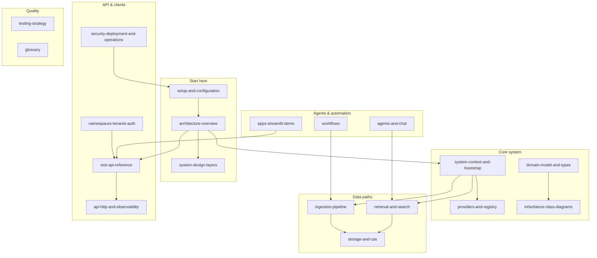
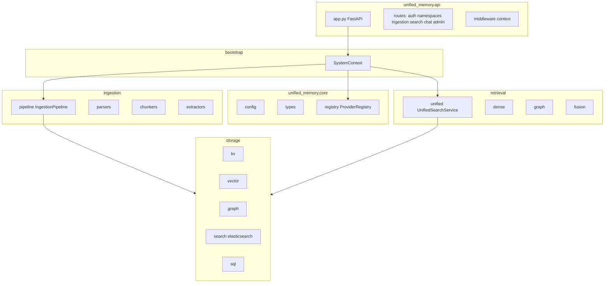

# Unified Memory System — Documentation

This folder is the **canonical** technical documentation for the `unified-memory-system` Python package (`src/unified_memory/`), the **`apps/`** demos, and the **`tests/`** suite. It uses **Markdown** and **Mermaid** diagrams (GitHub and most editors render both).

### Extended visual deep dive (MDX)

For a **longer, diagram-rich** walkthrough (multi-page **`.mdx`** chapters with many Mermaid figures), see **[`mdx/README.md`](./mdx/README.md)**. Those files are ideal for **Docusaurus / Nextra / Fumadocs** or VS Code preview; they complement—not replace—the Markdown guides here.

## Documentation map (coverage)

## Reading order (recommended)

| Order | Document | What you get |
| :---: | --- | --- |
| 1 | [Setup and configuration](./setup-and-configuration.md) | Python version, extras, `.env`, YAML, run API and tests |
| 2 | [Architecture overview](./architecture-overview.md) | **System context, containers, layers, deployment topology, data-store matrix**, ingest/search flows |
| 3 | [System design — layers](./system-design-layers.md) | **Layered architecture**, dependency direction, library vs HTTP |
| 4 | [System context and bootstrap](./system-context-and-bootstrap.md) | `SystemContext`, stores, `build_services`, hot reload |
| 5 | [Domain model and types](./domain-model-and-types.md) | **Hashes, ACL, core types, SQL tables overview** |
| 6 | [Providers and registry](./providers-and-registry.md) | `ProviderRegistry`, embedding/LLM/extractor/reranker keys |
| 7 | [Ingestion pipeline](./ingestion-pipeline.md) | Parse → chunk → embed → CAS/graph/vector/sparse |
| 8 | [Retrieval and search](./retrieval-and-search.md) | `UnifiedSearchService`, fusion, reranking |
| 9 | [Storage and CAS](./storage-and-cas.md) | KV, vector, graph, Elasticsearch, CAS |
| 10 | [Namespaces, tenants, and auth](./namespaces-tenants-auth.md) | Multi-tenancy, JWT flows |
| 11 | [REST API reference](./rest-api-reference.md) | **Full route table**, methods, ACL requirements |
| 12 | [API, HTTP, and observability](./api-http-and-observability.md) | Lifespan, middleware, deps, tracing, audit |
| 13 | [Security, deployment, and operations](./security-deployment-and-operations.md) | **Secrets, TLS, CORS, scaling, backups, checklist** |
| 14 | [Agents and chat](./agents-and-chat.md) | `QAAgent`, chat |
| 15 | [Workflows (Inngest)](./workflows.md) | Durable ingest/delete |
| 16 | [Streamlit demo app](./apps-streamlit-demo.md) | `apps/streamlit_demo` |
| 17 | [Testing strategy](./testing-strategy.md) | Unit vs integration, layout |
| 18 | [Inheritance and class diagrams](./inheritance-class-diagrams.md) | ABCs, protocols, subclass maps |
| — | [Glossary](./glossary.md) | Short definitions of terms |
| — | **[MDX deep dive](./mdx/README.md)** (optional) | Extended multi-page **`.mdx`** chapters with **many diagrams**; for doc sites or VS Code |

## Package map (quick reference)

## Legacy notes

Older narrative documents may exist under `old_docs/`. Prefer this `docs/` tree for accuracy; migrate any unique content from `old_docs/` when in doubt.
