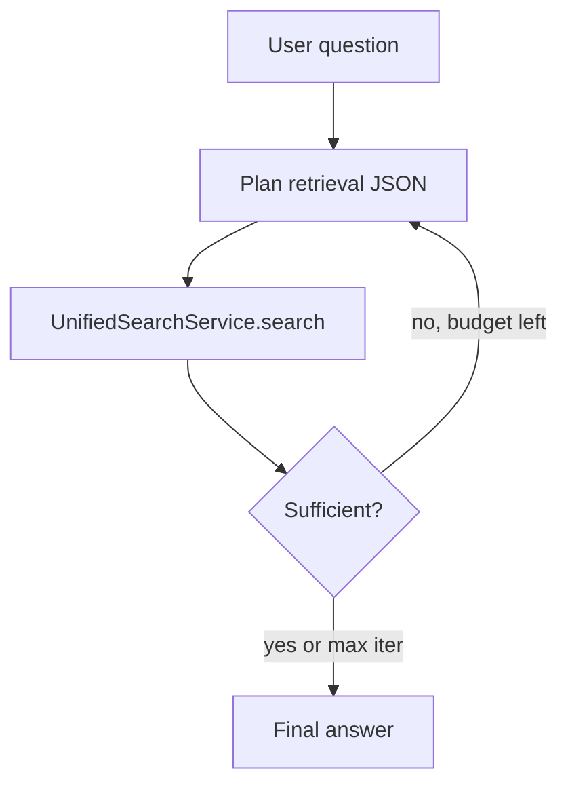

# Agents and chat

## `QAAgent`

**Location:** `unified_memory/agents/qa_agent.py`

A **ReAct-style** question-answering loop over **`UnifiedSearchService`**:

1. **Plan** retrieval (classify query, choose paths, optionally reformulate query).
2. **Execute** search with the unified service.
3. **Assess** whether results are sufficient.
4. **Iterate** up to **`MAX_ITERATIONS`** (3) with refined queries if needed.
5. **Generate** a grounded answer using a tenant-configured **`BaseLLMProvider`**.

### Dependencies

- **`UnifiedSearchService`** — hybrid retrieval.
- **`NamespaceManager`** — tenant/namespace config; resolves which LLM key to use.
- **`ProviderRegistry`** — **`get_llm_provider("provider:model")`**; falls back to first registered LLM if tenant config missing.
- **`ChatSessionManager`** (optional) — session-scoped document filters when `session_id` is provided.

### Tracing

`@traced("agent.answer")` wraps the public **`answer(...)`** method.

## Chat API and SQL

**`storage/sql/session_manager.py`** — **`ChatSessionManager`** persists chat threads for the HTTP API when SQL is configured.

Routes in **`api/routes/chat.py`** connect clients to **`ctx.qa_agent`** and session storage.

## Related types

- **`BaseLLMProvider`** — `llm/base.py`
- **Tokenizer / context budgeting** — `core/tokenizer.py` (`ContextWindowManager` used by the agent)
