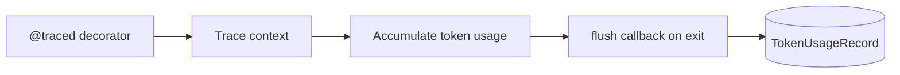

# API, HTTP, and observability

## FastAPI application

**Factory:** `unified_memory/api/app.py` — **`create_app()`** exposes **`app`** for uvicorn.

### Lifespan wiring

On startup:

1. Load **`SystemContext`** from `UMS_CONFIG` if the file exists, else empty defaults.
2. **`ctx.build_services(enable_inngest=...)`** — pipelines, search, QA agent, optional Inngest.
3. Create **async SQLAlchemy** engine from `UMS_DATABASE_URL`, **`init_db`**, session factory.
4. Attach **`sql_session_factory`**, **`ChatSessionManager`**, **`AuditLogger`**, **`TenantManager`** on context.
5. Register **`set_flush_callback`** so **`observability/tracing`** flushes **`TokenUsageRecord`** rows.

On shutdown: **`sql_engine.dispose()`**.

### Middleware stack

1. **CORS** — permissive defaults for development (`allow_origins=["*"]` — tighten for production).
2. **`RequestContextMiddleware`** — request context for tracing.

### Routers (prefix overview)

| Router module | Prefix | Concerns |
| --- | --- | --- |
| `routes/auth.py` | `/v1/auth` | Tenant/user registration, login, JWT |
| `routes/namespaces.py` | `/v1/namespaces` | Namespace CRUD, config, sharing |
| `routes/ingestion.py` | `/v1` | Ingest text/file, list/download/delete documents |
| `routes/search.py` | `/v1` | Unified search and answer |
| `routes/chat.py` | `/v1/chat` | Chat sessions, messages, session documents |
| `routes/admin.py` | `/v1/admin` | Tenant and user data admin |

**Full method/path table (kept current):** [rest-api-reference.md](./rest-api-reference.md).

### Authentication and ACL dependencies

**`api/deps.py`** exposes:

- **`get_system_context`** — `SystemContext` from `app.state`.
- **`get_current_user`** — Validates `Authorization: Bearer`, returns **`AuthenticatedUser`**.
- **`ACLChecker(required: Permission)`** — Ensures the user may access the **namespace** in the path (`READ`, `WRITE`, `DELETE`, `ADMIN`, `SHARE`) and **rejects cross-tenant** access.

Chat routes require **`chat_session_manager`** (SQL); if SQL is not wired, session endpoints return **501**.

### Health

`GET /health` → `{"status": "ok"}`.

### Inngest registration

A **`startup`** hook attempts **`inngest.fast_api.serve(app, client, functions)`** when Inngest is enabled and importable.

## Schemas

**`api/schemas.py`** — Pydantic request/response models shared by routes.

## Observability

| Module | Role |
| --- | --- |
| `observability/tracing.py` | Async trace context, `@traced` decorator, usage accumulation, flush callback to SQL **`token_usage`** |
| `observability/audit.py` | Persists **`AuditEvent`** rows for security-relevant actions |

**Metrics:** The **`server`** extra includes **`prometheus-client`** as a dependency; the default `app.py` does **not** mount a `/metrics` route—you can register one in your deployment if you need Prometheus scraping.

**Structured logging:** **`structlog`** is part of the server dependencies — configure JSON logging and ship to your aggregator in production.

### Tracing flow

## Environment summary (API)

| Env var | Effect |
| --- | --- |
| `UMS_CONFIG` | YAML path for `SystemContext` |
| `UMS_JWT_SECRET` | JWT signing |
| `UMS_TOKEN_EXPIRE_MINUTES` | Token TTL |
| `UMS_DATABASE_URL` | SQLAlchemy URL |
| `UMS_ENABLE_INNGEST` | Pass-through to `build_services` |
