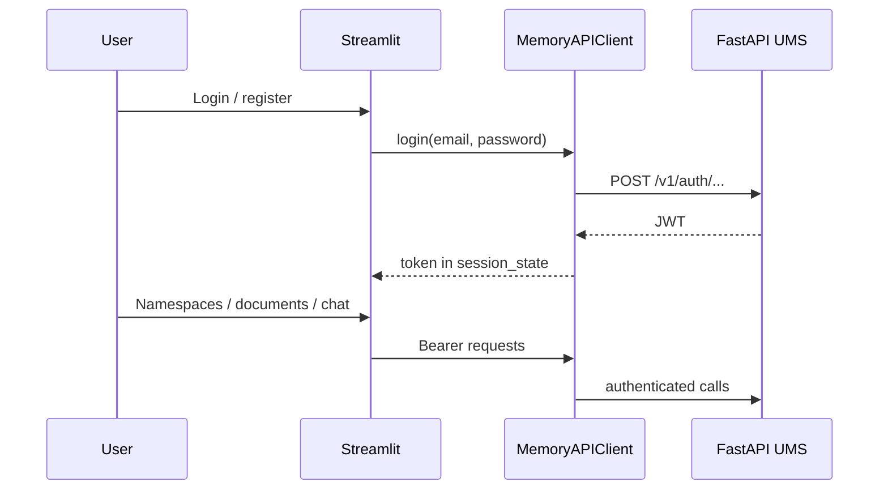

# Streamlit demo (`apps/streamlit_demo`)

A lightweight **browser UI** for exercising the Unified Memory HTTP API without writing a separate client.

## Layout

| Path | Role |
| --- | --- |
| `apps/streamlit_demo/app.py` | Main multipage entry: login/register, session state (`api_token`, `api_base_url`, `tenant_id`) |
| `apps/streamlit_demo/api_client.py` | **`MemoryAPIClient`** — thin HTTP wrapper for auth and API calls |
| `apps/streamlit_demo/pages/1_namespaces.py` | Namespace management UI |
| `apps/streamlit_demo/pages/2_documents.py` | Document upload / listing |
| `apps/streamlit_demo/pages/3_chat.py` | Chat / QA against the API |
| `apps/streamlit_demo/pages/4_admin.py` | Admin-style operations |

## Running

Install **`streamlit`** extra, ensure **`PYTHONPATH`** includes `src` (or run from a configured environment):

```bash
cd apps/streamlit_demo
streamlit run app.py
```

Default API base URL is **`http://localhost:8000`** (overridable in the sidebar/form).

## Flow



## Relationship to the library

The demo **does not** import `unified_memory` pipeline code directly for business logic; it is a **pure HTTP client**. Production integrations would follow the same pattern: obtain a JWT, then call REST endpoints.

See [api-http-and-observability.md](./api-http-and-observability.md) for server routes.
