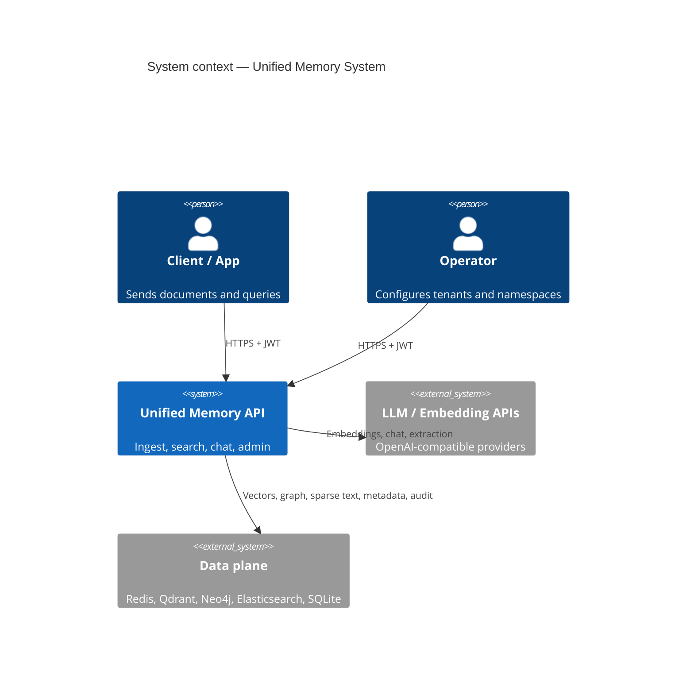
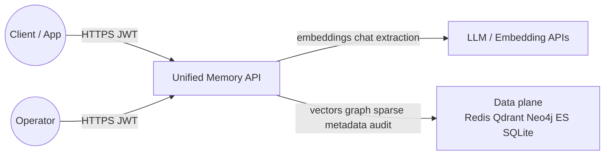
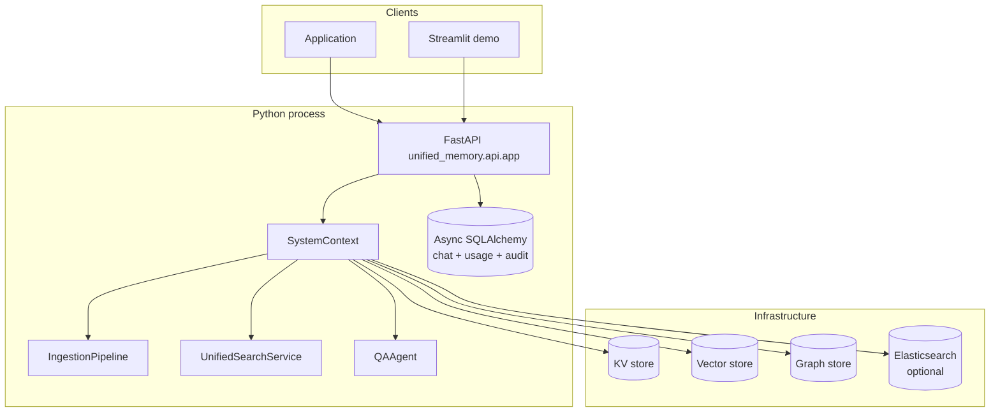
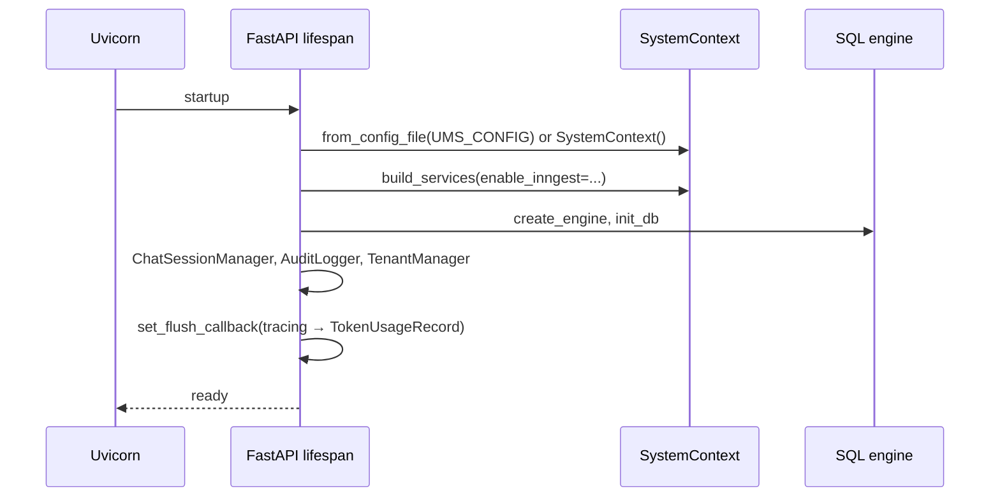
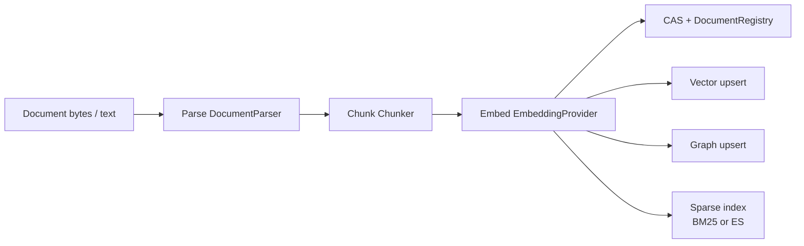
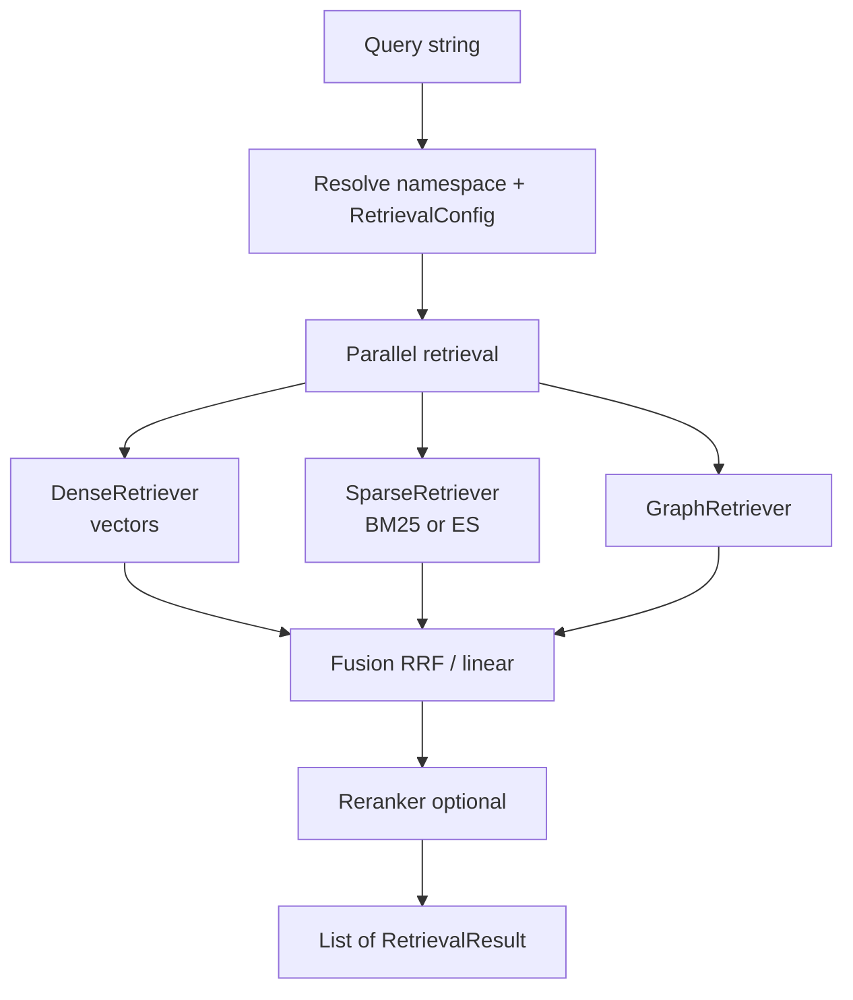
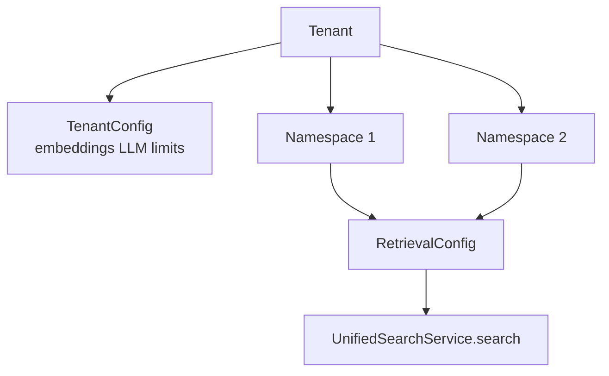
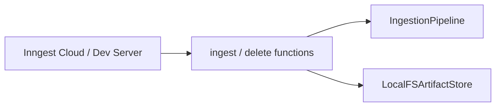
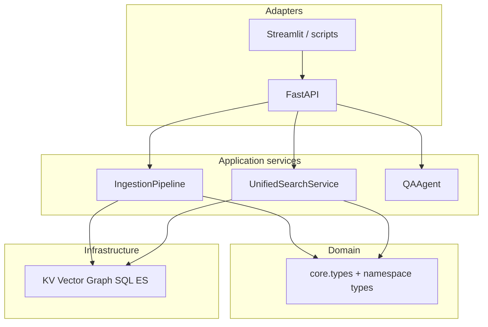
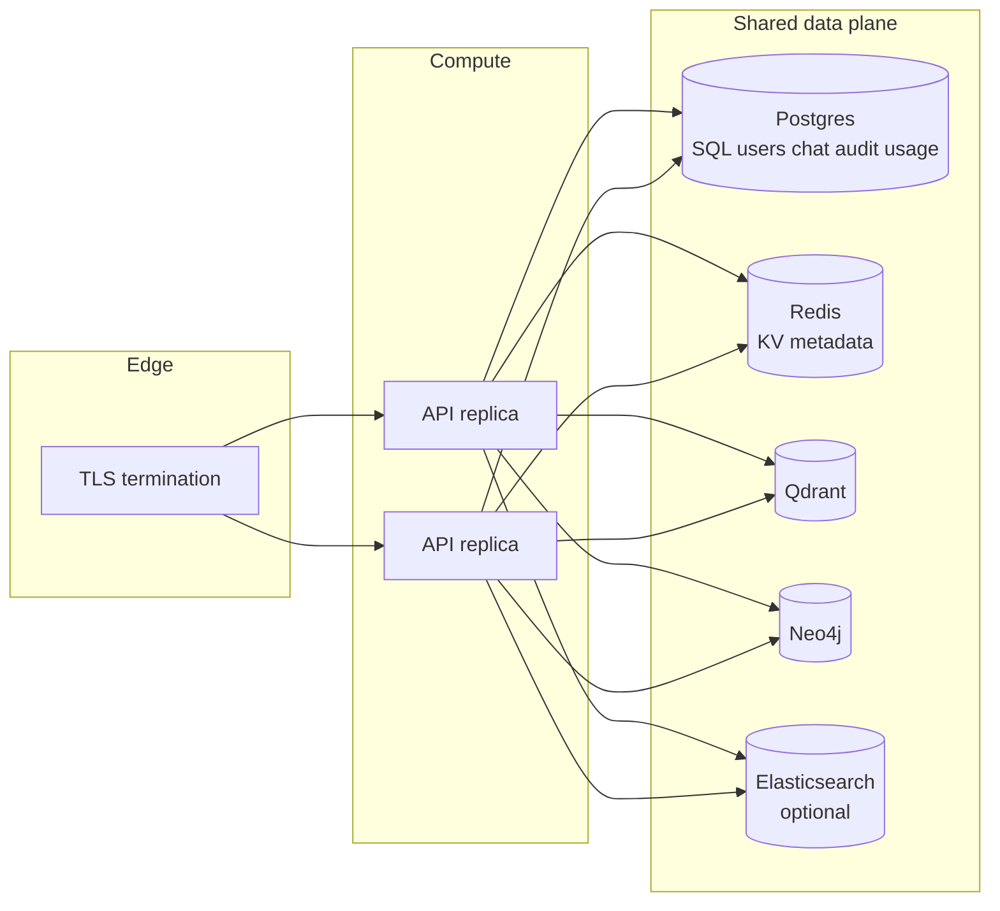

# Architecture overview

This document describes the **Unified Memory System** as implemented in this repository: a multi-tenant, multimodal memory layer with ingestion, hybrid retrieval, and an optional FastAPI surface.

## 1. System context (C4 Level 1)

External actors and systems interact with the **Unified Memory API** (and optional **Streamlit demo**). The service depends on pluggable **infrastructure**: KV, vector DB, graph DB, optional Elasticsearch, and optional **LLM/embedding APIs**.

If your renderer does not support **C4** syntax, use this equivalent:

## 2. Container view (logical)

## 3. Request-centric architecture

### 3.1 API startup sequence

### 3.2 Ingestion path (conceptual)

### 3.3 Search path (conceptual)

## 4. Multi-tenant model (high level)

Tenants and namespaces are persisted and validated through `NamespaceManager` and `TenantManager` (see [namespaces-tenants-auth.md](./namespaces-tenants-auth.md)).

## 5. Optional asynchronous workflows

When `UMS_ENABLE_INNGEST` is enabled and `build_services(enable_inngest=True)` runs, **Inngest** functions are created for durable **ingest** and **delete** pipelines using an artifact store for large payloads. The FastAPI app registers `inngest.fast_api.serve` when the client is present.

## 6. Logical layers (design view)

The same system can be viewed as **layers**: HTTP adapters → orchestration (`SystemContext`, pipelines, search) → domain types → infrastructure implementations. This complements the container diagram above.

Full narrative: [system-design-layers.md](./system-design-layers.md).

## 7. Deployment topology (typical production)

One **stateless** API tier talks to **shared** data services. In-memory backends are for **single-process** dev/test only.

Operational checklist: [security-deployment-and-operations.md](./security-deployment-and-operations.md).

## 8. Data-store responsibility matrix

| Store | Primary responsibility | Used for |
| --- | --- | --- |
| **KV** (`KVStoreBackend`) | Versioned metadata, CAS registry, namespace/tenant docs | Fast optimistic concurrency, registry state |
| **Vector** (`VectorStoreBackend`) | Embeddings and similarity search | Dense retrieval |
| **Graph** (`GraphStoreBackend`) | Entities, edges, PPR-style walks | Graph retrieval, provenance |
| **Elasticsearch** (optional) | Full-text inverted index | Sparse retrieval when `sparse_retriever: elasticsearch` |
| **SQL** (API mode) | Relational consistency | Users, passwords, chat, audit, **token_usage** |
| **CAS / artifact FS** | Blobs and large payloads | Content dedup, workflow externalization |

## 9. End-to-end request journeys (summary)

| Journey | Starts at | Core components |
| --- | --- | --- |
| **Register / login** | `/v1/auth/*` | `TenantManager`, JWT, SQL `users` |
| **Ingest document** | `/v1/ingest/*` | `IngestionPipeline`, stores, CAS |
| **Search** | `POST /v1/search/{namespace}` | `UnifiedSearchService`, fusion, reranker |
| **Chat** | `/v1/chat/*` | `ChatSessionManager`, `QAAgent`, SQL messages |

Detailed route table: [rest-api-reference.md](./rest-api-reference.md).

## 10. Where to read next

| Topic | Document |
| --- | --- |
| Layering and dependency rules | [system-design-layers.md](./system-design-layers.md) |
| Class wiring and stores | [system-context-and-bootstrap.md](./system-context-and-bootstrap.md) |
| Domain types and ACL | [domain-model-and-types.md](./domain-model-and-types.md) |
| Ingestion internals | [ingestion-pipeline.md](./ingestion-pipeline.md) |
| Search and fusion | [retrieval-and-search.md](./retrieval-and-search.md) |
| REST API | [rest-api-reference.md](./rest-api-reference.md) |
| Security / ops | [security-deployment-and-operations.md](./security-deployment-and-operations.md) |
| HTTP internals | [api-http-and-observability.md](./api-http-and-observability.md) |
