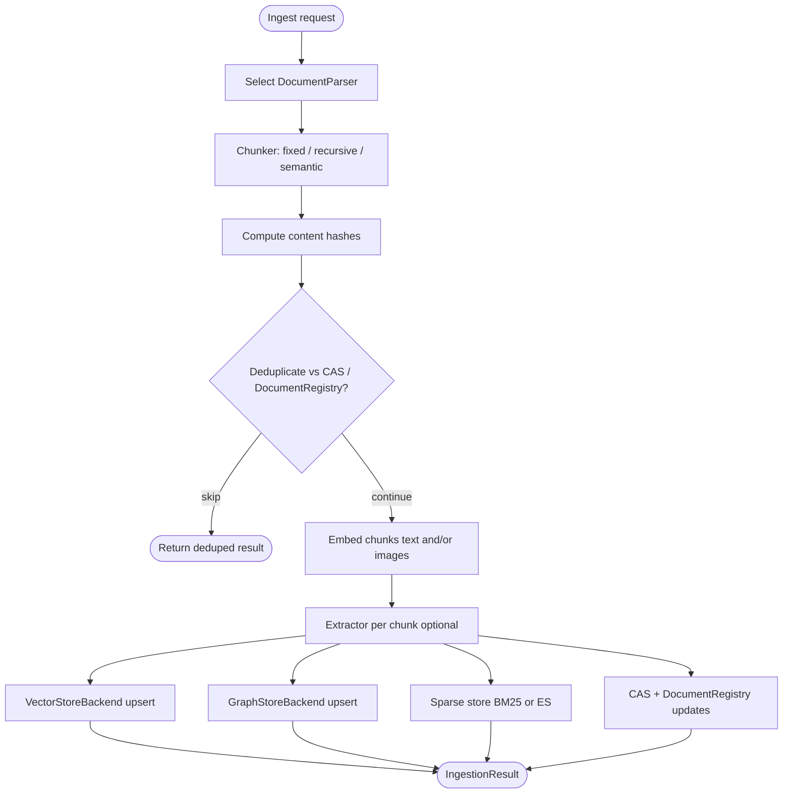

# Ingestion pipeline

**Primary type:** `unified_memory.ingestion.pipeline.IngestionPipeline`

The pipeline orchestrates **document ingestion**: turning raw files or text into **chunks**, **embeddings**, **graph nodes/edges**, **sparse index entries**, and **CAS-backed metadata**, with **namespace-aware** deduplication and deletion semantics.

## Design themes

1. **Saga-style orchestration** — Multi-step writes with compensating actions on failure (see implementation for rollback behavior per store).
2. **Content-addressable storage (CAS)** — Document and chunk identity tied to hashes for deduplication across namespaces.
3. **Pluggable stages** — Parsers, chunkers, embedders, and extractors come from the **`ProviderRegistry`** or explicit constructor args.
4. **Multimodal** — Text and vision embedding providers; optional image/document content stores for large binaries.

## High-level flow

## Main dependencies (constructor)

| Parameter | Role |
| --- | --- |
| `vector_store`, `graph_store`, `sparse_store` | Write paths for retrieval indexes |
| `cas_registry`, `content_store` | Blob/hash registry and content payloads |
| `document_registry` | Per-document records and namespace linkage |
| `namespace_manager` | Tenant/namespace config, validation |
| `provider_registry` | Parsers, embedders, extractors |
| `embedding_provider`, `vision_embedding_provider` | Default embedders |
| `artifact_store`, `image_content_store`, `document_content_store` | Large payload offload paths |

## Chunkers

**Base:** `ingestion/chunkers/base.py` — abstract **`Chunker`** with **`ChunkingConfig`**.

| Implementation | File | Use case |
| --- | --- | --- |
| `FixedSizeChunker` | `chunkers/fixed_size.py` | Token/char windows with overlap |
| `RecursiveChunker` | `chunkers/recursive.py` | Hierarchical splitting |
| `SemanticChunker` | `chunkers/semantic.py` | Embedding similarity boundaries |

Configuration guards (e.g. `chunk_overlap < chunk_size`) prevent infinite loops.

## Parsers

**Base:** `ingestion/parsers/base.py` — **`DocumentParser`** producing **`ParsedDocument`**.

Built-in examples include **`TextParser`** and optional **`MinerUPDFParser`** when MinerU is installed.

## Extractors

**Base:** `ingestion/extractors/base.py` — **`Extractor.extract(chunk) -> ExtractionResult`**

Used to emit **entities and relations** that populate the graph and enrich metadata.

## PDF and rich documents

`ingestion/parsers/mineru_pdf.py` integrates **MinerU** when the optional dependency group is installed; bootstrap registers the parser only if `is_mineru_available()`.

## Result types

- **`IngestionResult`**: `document_id`, `source`, `chunk_count`, `deduped`, `doc_hash`, `errors`, etc.
- **`DeleteResult`**: Tracks vectors/nodes **deleted** vs **unlinked** when a document is removed from a namespace but may remain for other tenants.

## Observability

Pipeline steps use **`@traced`** from `observability/tracing.py` where instrumented, feeding token usage and timing into the async trace context (flushed to SQL in API mode).

## Related code references

- Orchestration entrypoints: methods okn `IngestionPipeline` in `ingestion/pipeline.py`
- Types: `unified_memory/core/types.py` (`Chunk`, `SourceReference`, relations, etc.)
