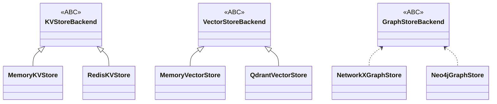
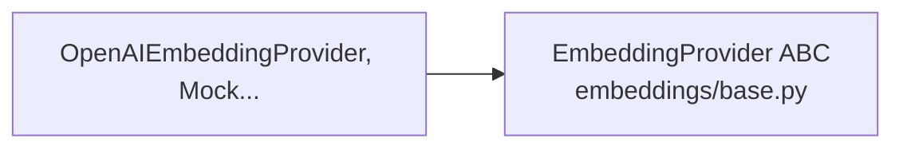
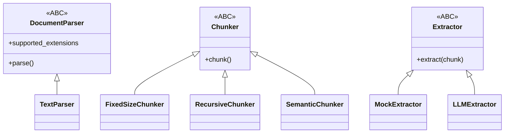

# Inheritance, protocols, and subclass maps

This codebase mixes **abstract base classes (ABC)**, concrete subclasses, and **`typing.Protocol`** for structural subtyping. This page maps the **main hierarchies** so you can navigate quickly.

## 1. Storage layer

See [storage-and-cas.md](./storage-and-cas.md) for narrative detail.

## 2. Embedding providers

- **`embeddings/base.py`**: **`EmbeddingProvider` (ABC)** — primary implementation hierarchy for OpenAI, mock, etc.
- `core/interfaces.py` no longer defines a duplicate `EmbeddingProvider` protocol.

## 3. LLM providers

- **`llm/base.py`**: **`BaseLLMProvider`** — `generate`, `generate_structured`, optional `generate_with_images`.
- `core/interfaces.py` no longer defines a duplicate `LLMProvider` protocol.

**Implementation:** `llm/openai_provider.py` (registered in bootstrap).

## 4. Ingestion: parsers, chunkers, extractors

| Abstraction | Base | Implementations (examples) |
| --- | --- | --- |
| Parsers | `DocumentParser` (`ingestion/parsers/base.py`) | `TextParser`, `MinerUPDFParser` |
| Chunkers | `Chunker` (`ingestion/chunkers/base.py`) | `FixedSizeChunker`, `RecursiveChunker`, `SemanticChunker` |
| Extractors | `Extractor` (`ingestion/extractors/base.py`) | Mock, LLM-backed extractors |

## 5. Retrieval

**Retriever classes** (`DenseRetriever`, `GraphRetriever`) are **orchestrators**, not a deep inheritance tree; they depend on **store backends** and **`NamespaceManager`**.

**`SparseRetriever`** is defined as a **`Protocol`** in `core/interfaces.py` and implemented by the in-process BM25 path and **`ElasticSearchStore`**.

## Canonical interfaces still in `core/interfaces.py`

`core/interfaces.py` now only contains protocol-only interfaces that do not have parallel ABC hierarchies:

- `Reranker`
- `SparseRetriever`

## 6. Agents

**`QAAgent`** is a **plain class** (no subclass hierarchy); it **composes** `UnifiedSearchService`, `NamespaceManager`, and `ProviderRegistry`.

## 7. When to extend

| Goal | Extend / implement |
| --- | --- |
| New vector database | Subclass **`VectorStoreBackend`** |
| New graph database | Implement **`GraphStoreBackend`** |
| New file format | Subclass **`DocumentParser`** and register in bootstrap |
| New chunking strategy | Subclass **`Chunker`** |
| New entity extraction | Subclass **`Extractor`** |
| New embedding API | Subclass **`EmbeddingProvider`** in `embeddings/base.py` |
| New chat model | Subclass **`BaseLLMProvider`** |

Always register new providers in **`SystemContext._register_providers`** or your own bootstrap code.
