# System overview (extended)

This chapter gives a **visual, layered** picture of the **Unified Memory System**: who talks to it, what runs inside one process, which external systems it depends on, and how **ingest** and **search** journeys flow through the architecture.

---

## 1. Problem space (what the system optimizes for)

The platform combines:

1. **Durable, tenant-scoped memory** — not a single vector index, but **namespaces**, **ACLs**, and **config** per tenant.
2. **Hybrid retrieval** — **dense** (embeddings), **sparse** (lexical), and **graph** signals, fused and optionally **reranked**.
3. **Operational shape** — optional **HTTP API**, **SQL** for users/chat/audit/usage, **tracing** hooks, optional **Inngest** workflows.

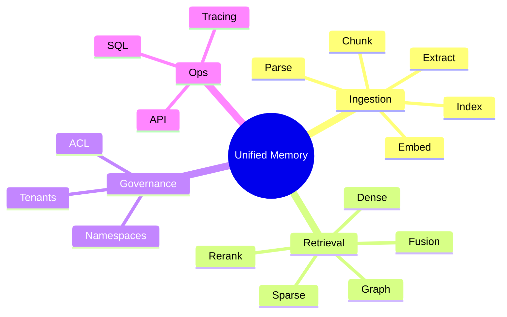

---

## 2. System context (external actors)

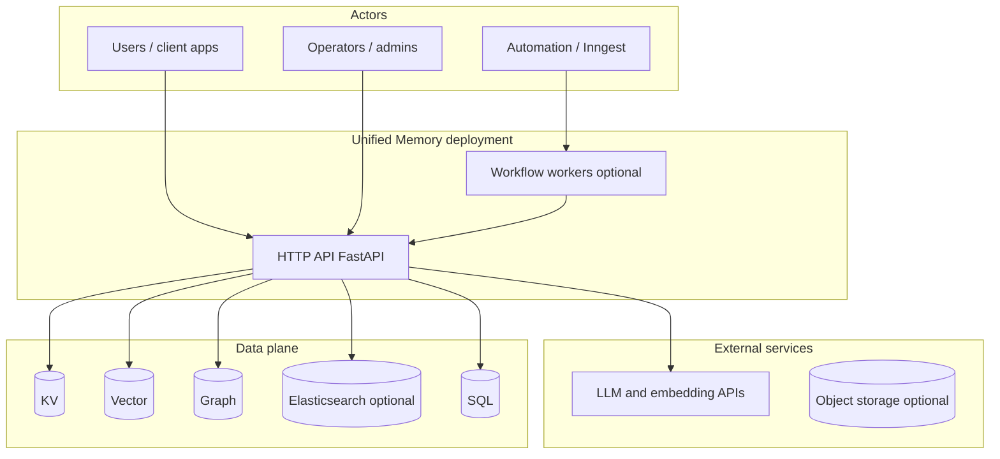

**Reading the diagram:** clients interact with **FastAPI**; optional **Inngest** (or similar) drives durable workflows that still call into the same **ingestion** logic. **LLM/embedding** calls leave the process to vendor APIs. **Five storage roles** appear (KV, vector, graph, optional ES, SQL)—each has different consistency and query semantics (see Storage chapter).

---

## 3. Container view (single API process)

One **Python process** typically hosts **FastAPI**, **SystemContext**, and orchestration services. **SQL** is often Postgres or SQLite; **KV/vector/graph/ES** are separate processes or managed services.

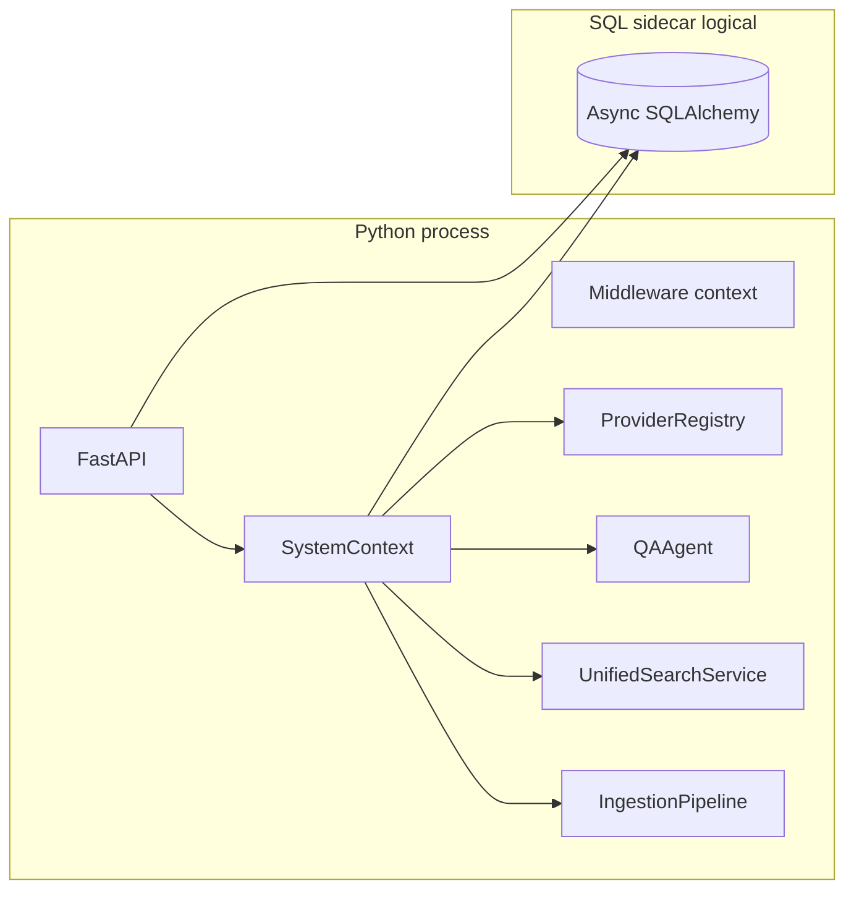

**QAAgent** depends on **UnifiedSearchService** and **ProviderRegistry**; **chat** routes depend on **SQL** session manager when enabled.

---

## 4. Logical layering (dependency direction)

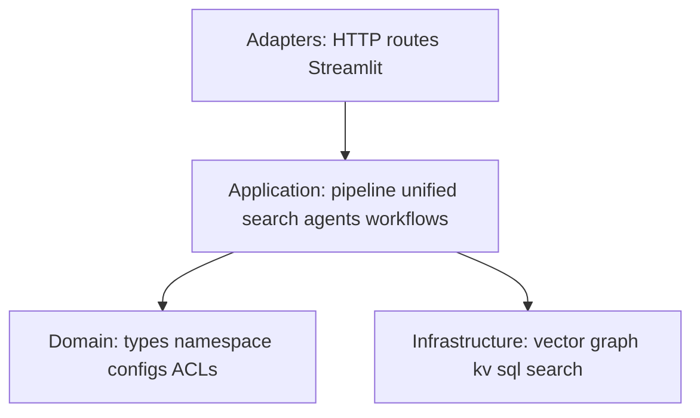

**Intent:** **routes** do not embed vendor SDK details; **orchestration** (`IngestionPipeline`, `UnifiedSearchService`) depends on **abstractions** and **domain types**; **infrastructure** implements protocols/ABCs.

---

## 5. Data-store responsibility (mental model)

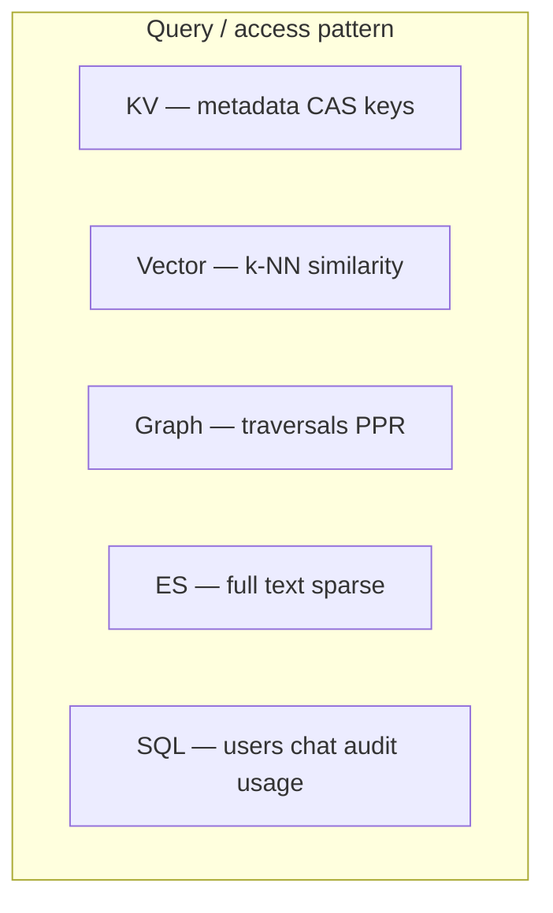

| Store | Primary job |
|-------|----------------|
| **KV** | Versioned metadata, CAS registry, namespace docs |
| **Vector** | k-NN / similarity over embeddings |
| **Graph** | Entities, edges, PPR-style walks |
| **Elasticsearch** (optional) | Full-text sparse retrieval when configured |
| **SQL** | Users, passwords, chat, audit, token usage rows |

---

## 6. End-to-end: HTTP request lifecycle (conceptual)

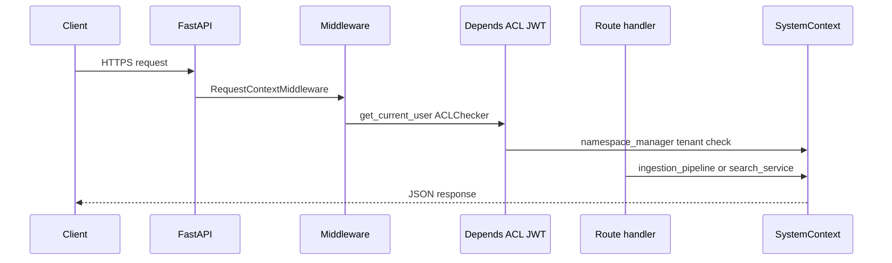

---

## 7. End-to-end: search journey (high level)

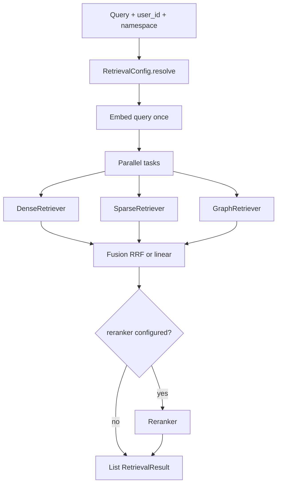

---

## 8. End-to-end: ingestion journey (high level)

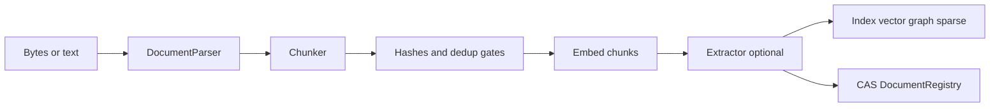

---

## 9. Multi-tenant isolation (conceptual)

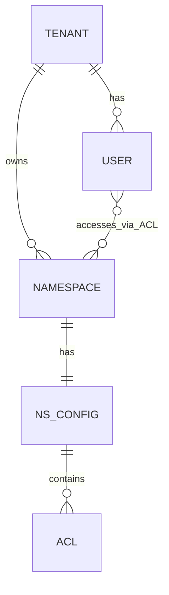

Implementation detail: isolation is enforced in **KV-stored configs**, **HTTP ACL**, and **hash scoping** (`tenant_id` in content/document hashes)—see Domain and API chapters.

---

## 10. Optional asynchronous workflows (Inngest)

When enabled, durable **ingest** / **delete** functions run outside the hot request path but call the same **IngestionPipeline** with **artifact** externalization for large payloads.

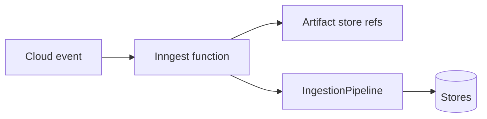

---

## 11. Failure domains (where things break independently)

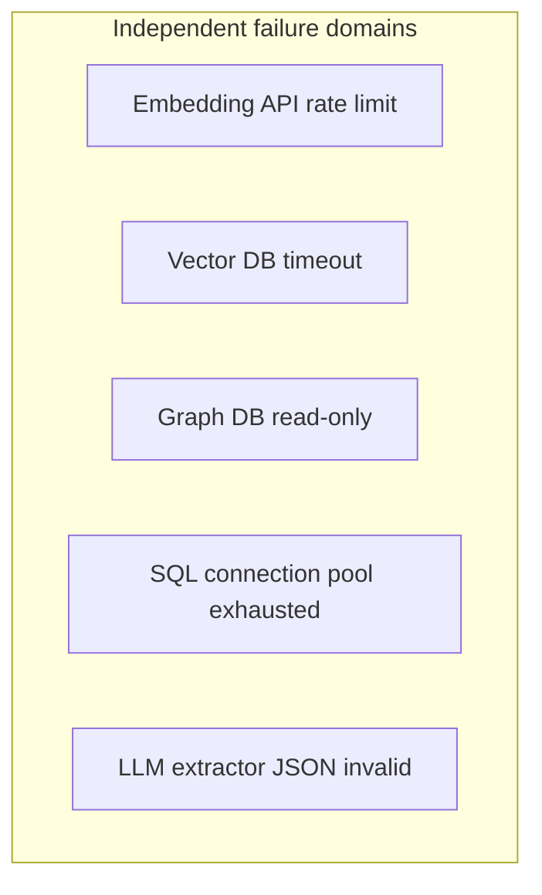

**Operations implication:** monitor each **backend** separately; **circuit breakers** and **timeouts** per dependency class reduce cascading outages.

---

## 12. Figure: simplified deployment (HA-ish)

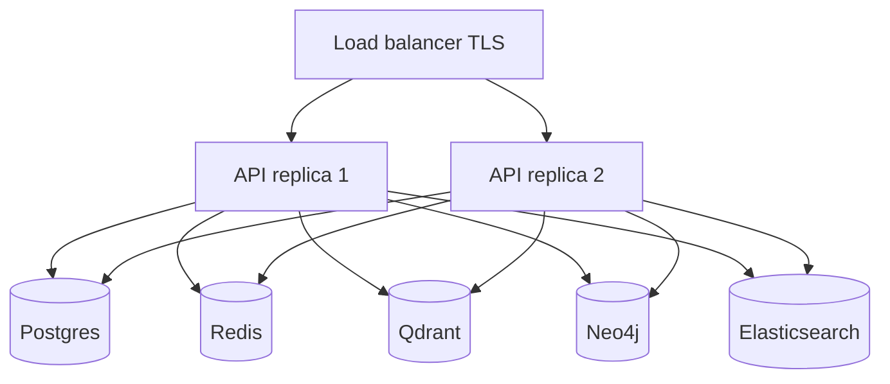

**Constraint:** **In-memory** KV/vector/graph **cannot** be shared across replicas—use real backends for horizontal scale.

---

## Next chapters

- [Bootstrap and providers](/docs/bootstrap-and-providers) — how `SystemContext` wires concrete implementations.
- [Ingestion pipeline](/docs/ingestion-pipeline) — deeper ingest stages and CAS.
- [Retrieval, fusion, reranking](/docs/retrieval-fusion-rerank) — parallel retrieval and score fusion.
- [Agents, workflows, and client apps](/docs/agents-workflows-and-apps) — QAAgent, Inngest, Streamlit demo (easy to miss if you only read chapters 00–05).
- [Domain validation and quality](/docs/domain-validation-and-quality) — namespace grammar, JSON repair, embedding cache, and how MDX relates to `docs/*.md`.

**Canonical companion:** the full **documentation map** and reading order live in **`docs/README.md`** (Markdown in the repo `docs/` folder). Use it for **route tables**, **security checklists**, and **testing** detail not repeated in MDX.
