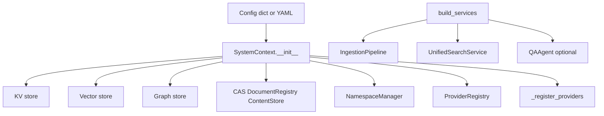
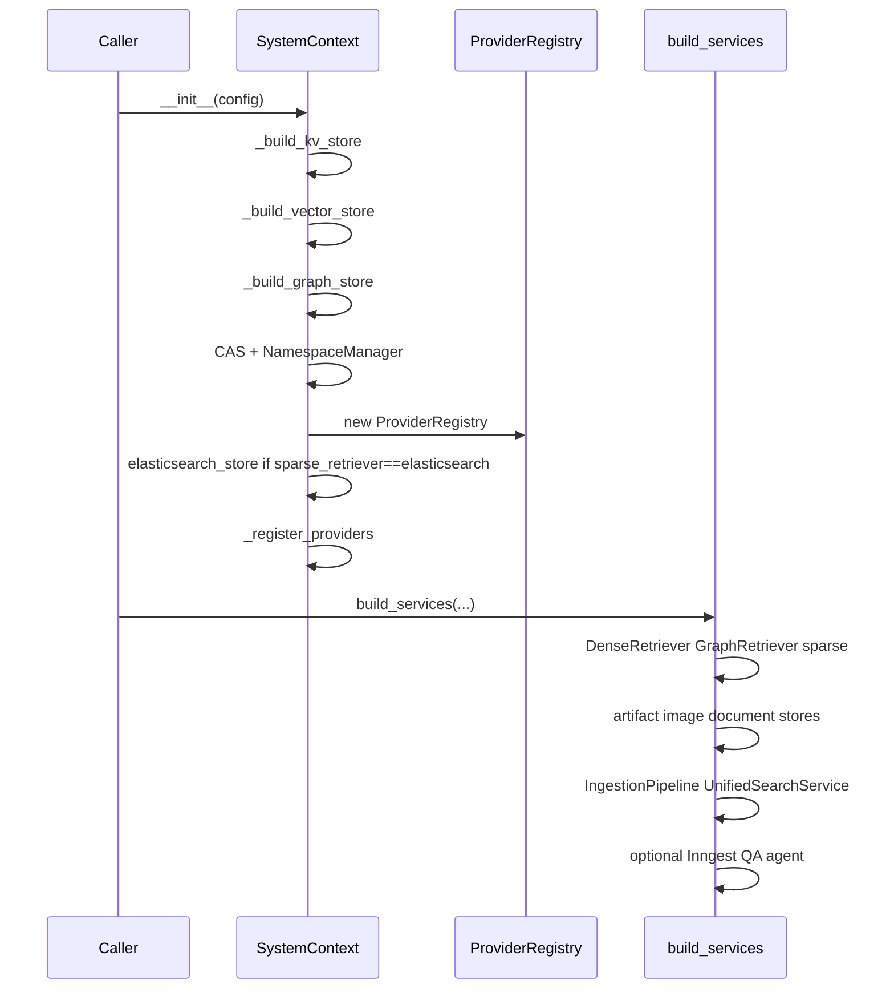
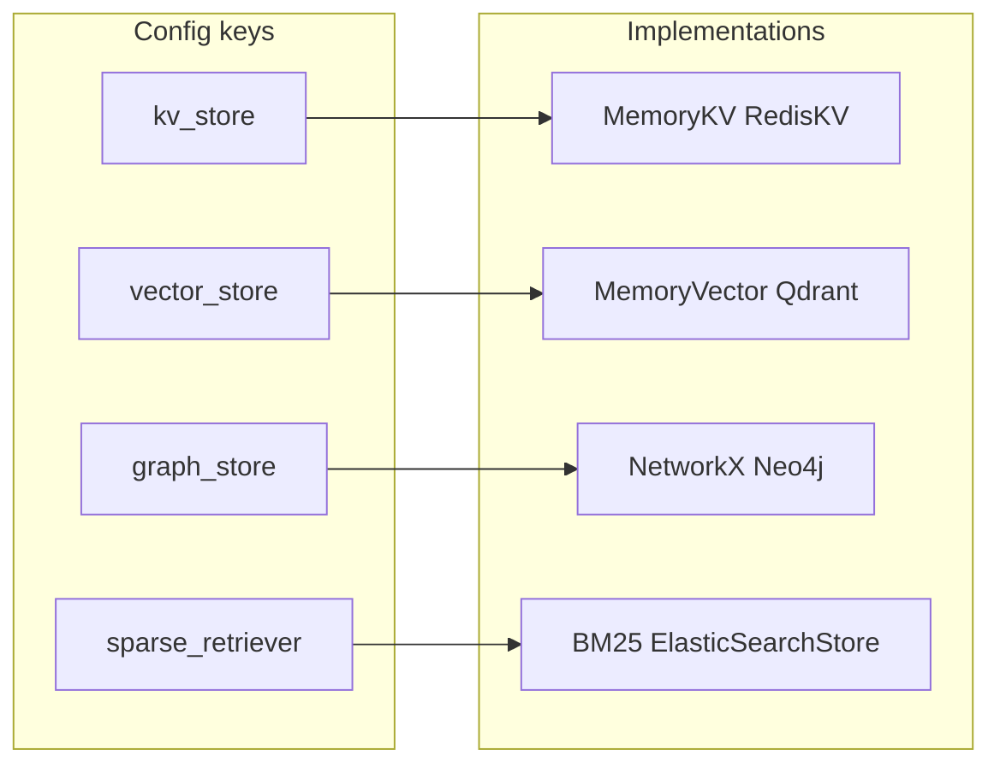
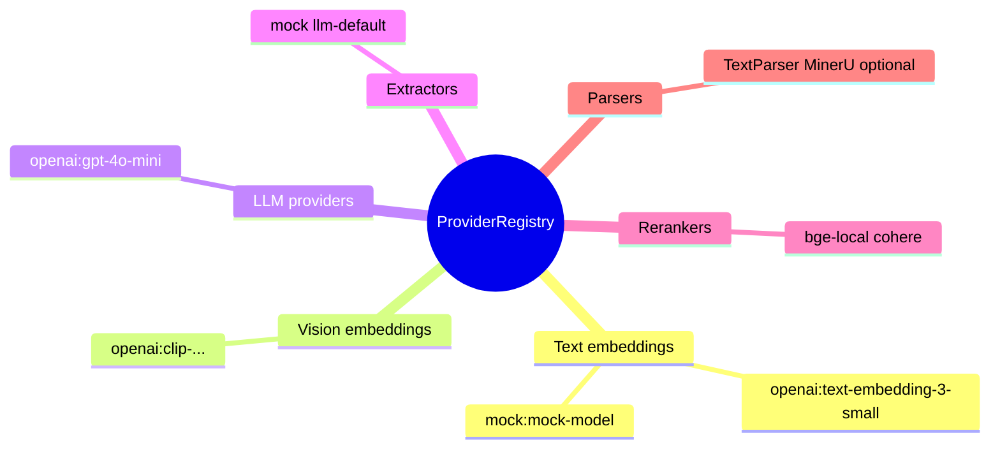
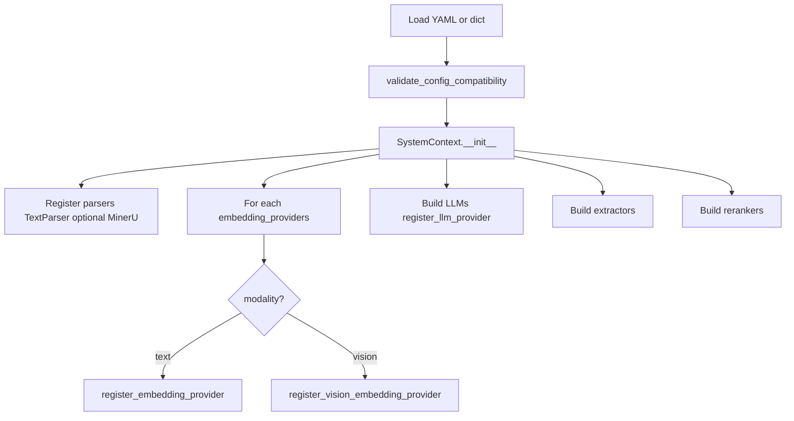
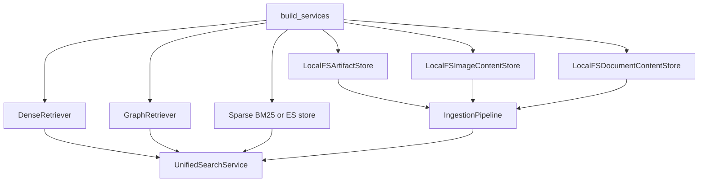
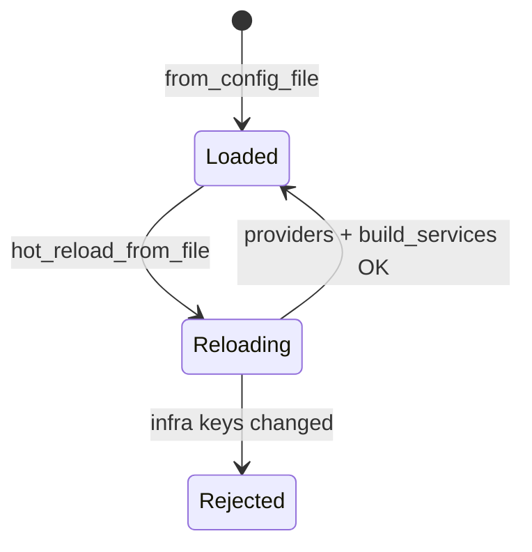
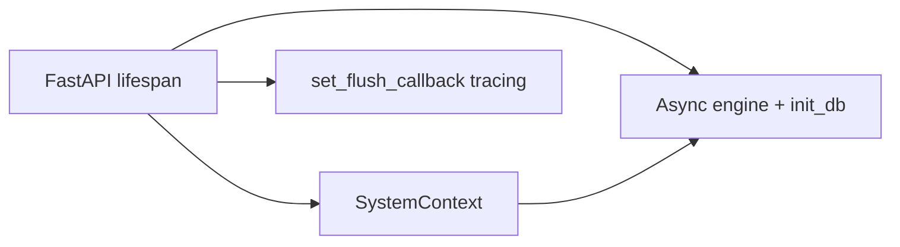
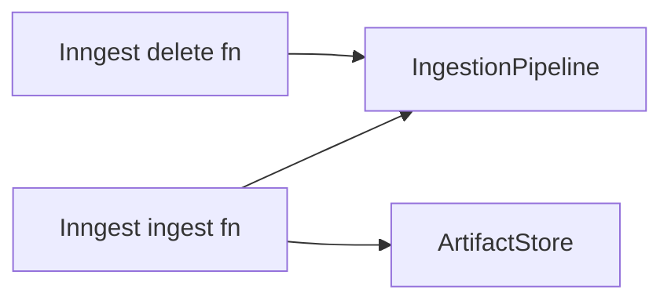
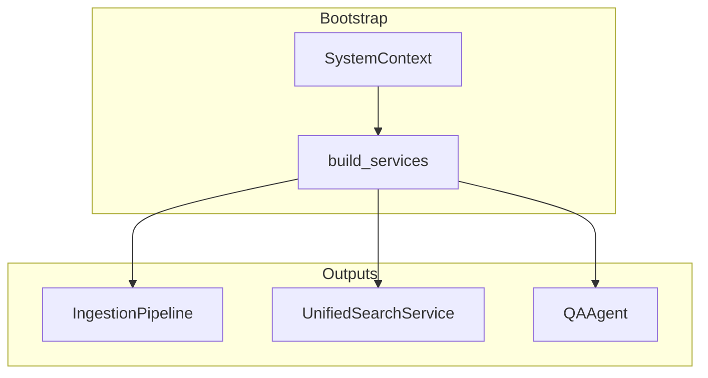

# Bootstrap and providers (extended)

This chapter details **`SystemContext`** (`unified_memory.bootstrap`): how **infrastructure** is chosen, how **providers** are registered, and how **`build_services`** assembles **IngestionPipeline**, **UnifiedSearchService**, and optional **Inngest** / **QAAgent**.

---

## 1. Composition root pattern

`SystemContext` is the **single composition root** for library mode: one object holds **stores**, **registries**, and **high-level services**.

---

## 2. Construction sequence (ordered)

---

## 3. Infrastructure matrix (dict → implementation)

| Config | Values | Notes |
|--------|--------|--------|
| `kv_store` | `memory`, `redis` | Metadata and CAS; use **redis** for multi-process |
| `vector_store` | `memory`, `qdrant` | Similarity search |
| `graph_store` | `networkx`, `neo4j` | Graph traversal |
| `sparse_retriever` | `bm25`, `elasticsearch` | If ES, one **ElasticSearchStore** instance often doubles as sparse backend |

---

## 4. ProviderRegistry contents

**Modality routing:** YAML `modality: text` vs `vision` / `image` decides whether a key is registered as **text** or **vision** embedding provider.

---

## 5. Registration flow (bootstrap)

---

## 6. build_services: what gets created

---

## 7. Hot reload (conservative)

`hot_reload_from_file` **re-registers** providers and **rebuilds** services but **refuses** to swap **kv_store**, **vector_store**, **graph_store**, or **sparse_retriever** if an `AppConfig` was already loaded.

---

## 8. API-only attachments (lifespan)

When running **FastAPI**, the lifespan wires **SQL**, **ChatSessionManager**, **AuditLogger**, **TenantManager**, and **tracing flush** to `TokenUsageRecord`. These fields are **not** required for pure library use.

---

## 9. Optional Inngest wiring

When `enable_inngest=True`, `_setup_inngest` creates client + **ingest** and **delete** functions referencing the same pipeline and artifact store.

---

## 10. Summary figure: one page cheat sheet

See also: [System overview](/docs/system-overview), [Configuration matrix](/docs/configuration-matrix), [Storage and data plane](/docs/storage-data-plane), [Agents, workflows, and client apps](/docs/agents-workflows-and-apps).
