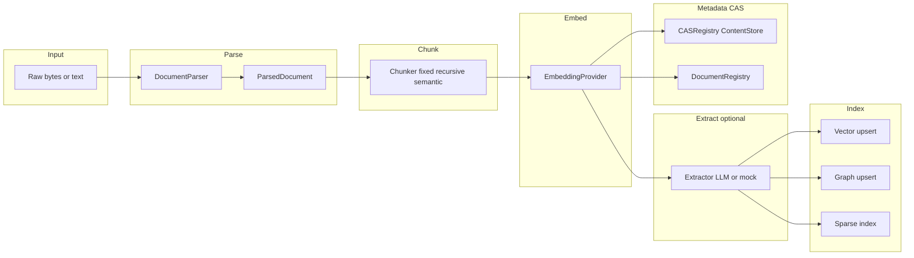
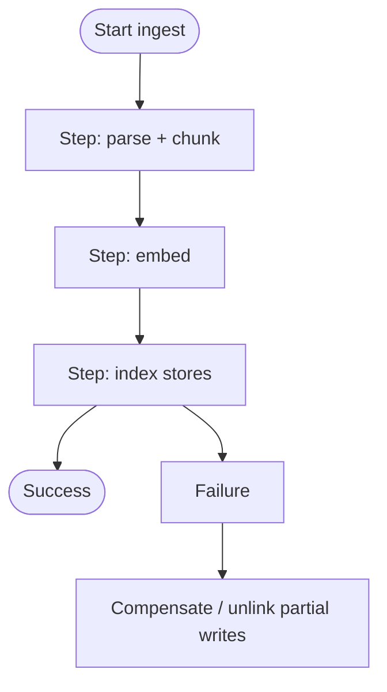
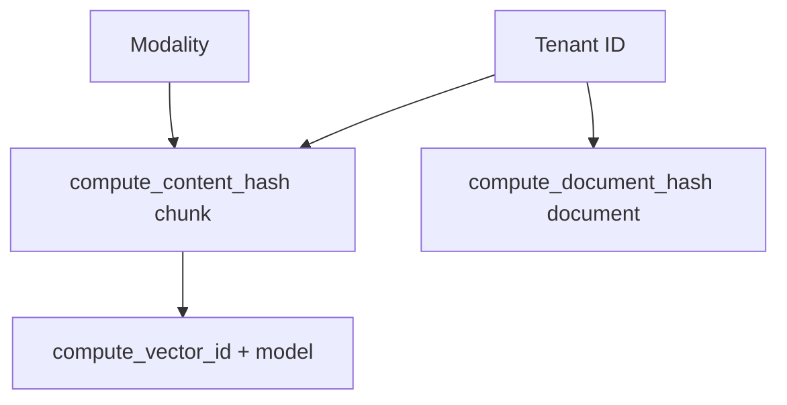
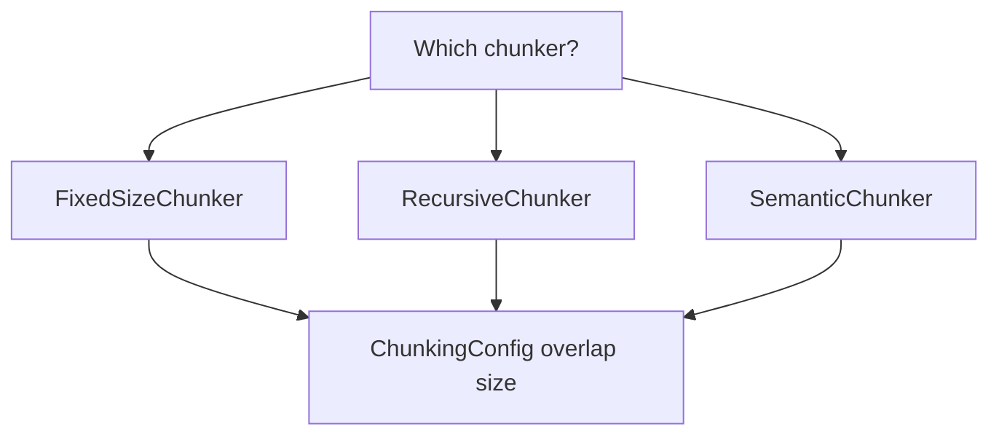
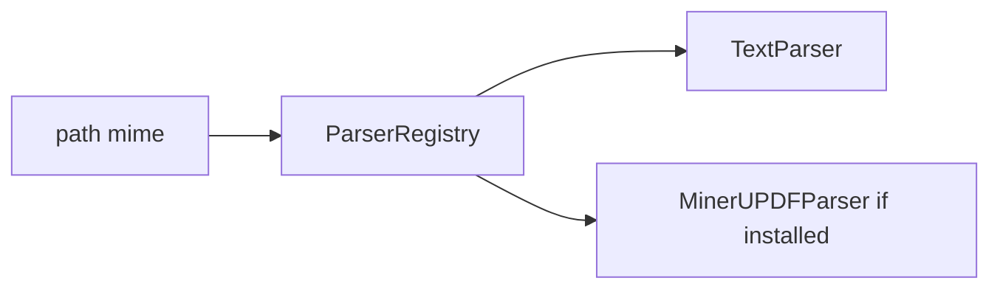
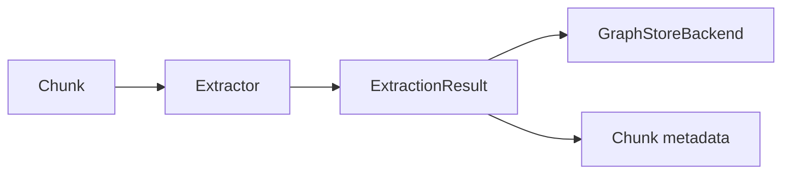
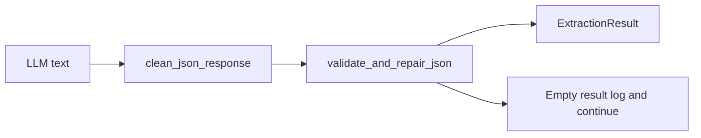
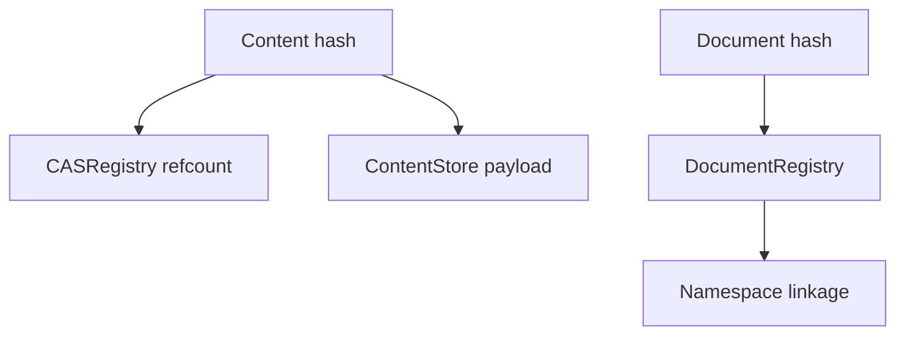
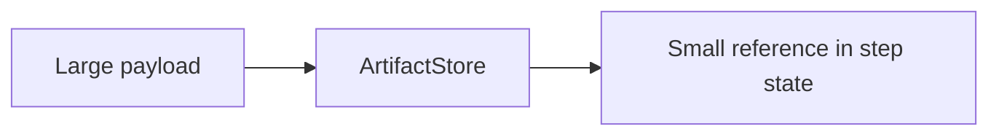
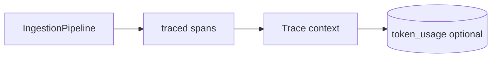

# Ingestion pipeline (extended)

**`IngestionPipeline`** orchestrates turning **raw input** into **indexed memory**: parsed structure, **chunks**, **embeddings**, optional **entity/relation extraction**, writes to **vector**, **graph**, and **sparse** indexes, and **CAS** / **document registry** updates—with **namespace** and **tenant** awareness.

---

## 1. Stage model (conceptual pipeline)

---

## 2. Saga-style orchestration (intent)

Ingestion performs **multiple writes** (vector, graph, KV metadata). The implementation follows **saga-like** patterns: progress with **compensating** steps on failure where applicable (see source for exact rollback semantics per store).

---

## 3. Hashing and deduplication (conceptual)

Content and document identities use **canonical hash helpers** from `core.types` (tenant-scoped).

**Implication:** same **normalized** document text under a tenant maps to a stable **document hash** independent of embedding model; **vector ids** include **model** so re-embedding with another model does not silently overwrite.

---

## 4. Chunking strategies (selection)

`ChunkingConfig` enforces **`chunk_overlap < chunk_size`** to avoid infinite loops.

---

## 5. Parser registry

Bootstrap registers **TextParser** and optionally **MinerU** PDF when available. The pipeline resolves parsers via **`ParserRegistry`** / provider registry.

---

## 6. Extractors and graph population

**Extractor** implementations turn **chunks** into **ExtractionResult** (entities, relations) used to enrich **graph** edges/nodes and metadata.

---

## 6b. LLM extractor and robust JSON

**`LLMExtractor`** (`ingestion/extractors/llm_extractor.py`) prompts **`BaseLLMProvider.generate_structured`** for a JSON object with **`entities`** and **`relations`** (see **`ingestion/extractors/schema.py`** for typed results).

**Failure behavior:** parsing uses **`core.json_utils.validate_and_repair_json`** (with **`json-repair`**) after **`clean_json_response`** strips common markdown fences. If extraction still fails, the pipeline returns an **empty** `ExtractionResult` and **logs**—ingest continues without graph enrichment for that chunk.

---

## 7. CAS and document registry (logical)

**Delete semantics:** vectors/nodes may be **hard-deleted** or **unlinked** depending on whether other namespaces still reference the same content (see integration tests for refcount behavior).

---

## 8. Artifact stores (large payloads)

For workflows or large binaries, **LocalFSArtifactStore** and related stores **externalize** heavy blobs so orchestration layers (e.g. Inngest steps) keep small JSON payloads.

---

## 9. Observability on the pipeline

Key methods use **`@traced`** so retrieval and generation accumulate **usage** records flushed to SQL in API mode.

---

## 10. Failure modes (operator view)

| Stage | Typical failure | Mitigation |
|-------|-----------------|------------|
| Parse | Unsupported format | Register parser or reject with 400 |
| Chunk | Config overlap error | Fix ChunkingConfig |
| Embed | Rate limit / timeout | Retry policy, backoff |
| Vector | Dimension mismatch | Align tenant embedding config with index |
| Graph | Connection | Health checks, circuit breaker |

---

## Next

- [Retrieval, fusion, reranking](/docs/retrieval-fusion-rerank) — how indexed content is found again.
- [Storage and data plane](/docs/storage-data-plane) — store responsibilities in depth.
