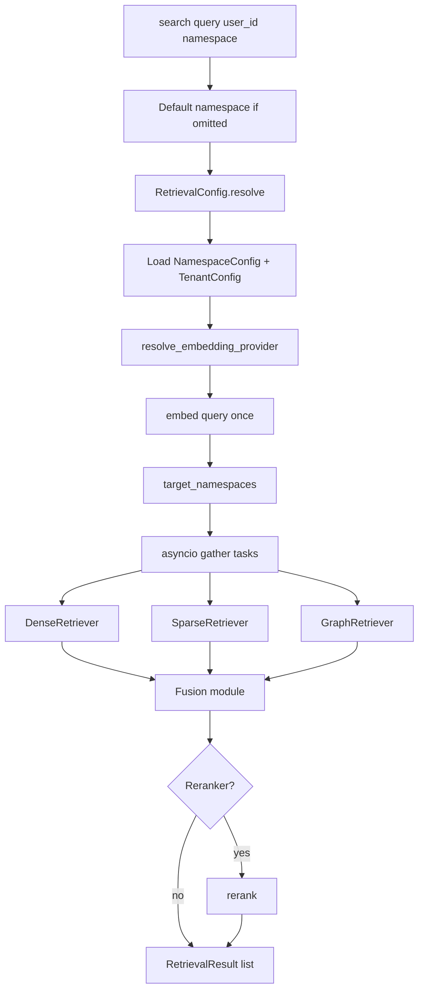
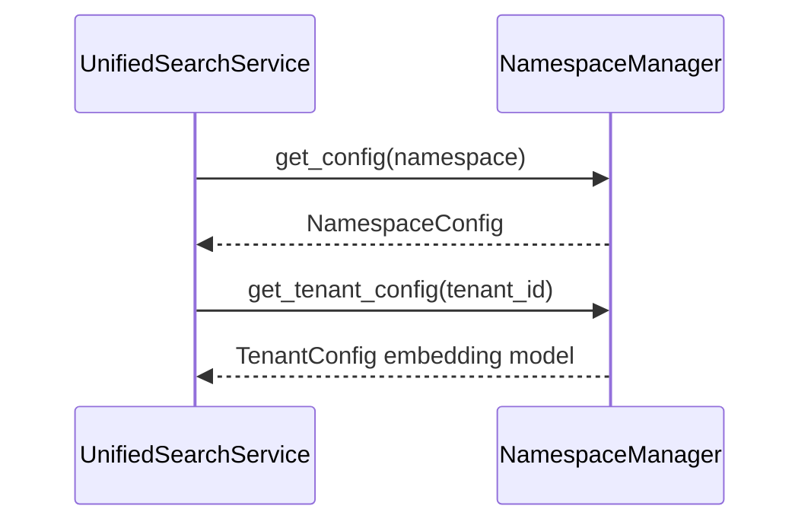
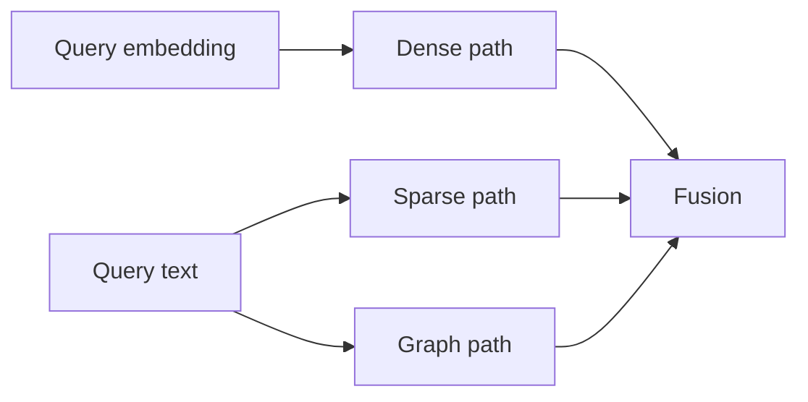
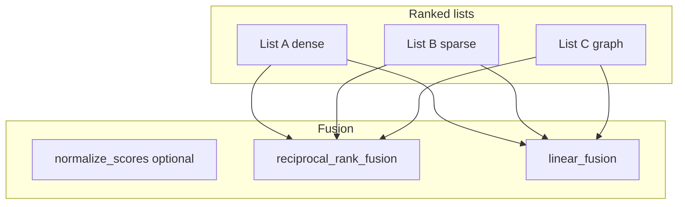
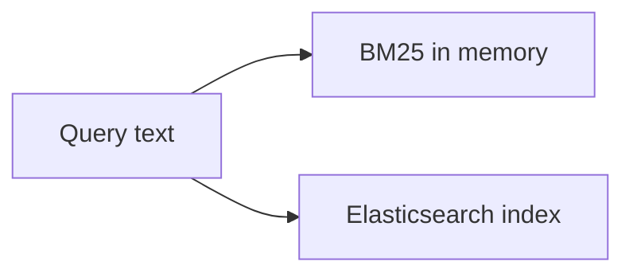
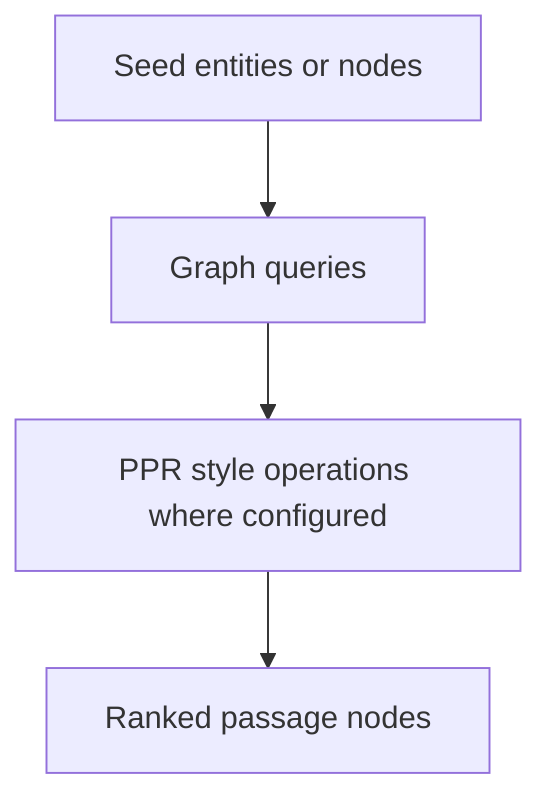
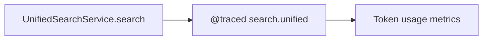
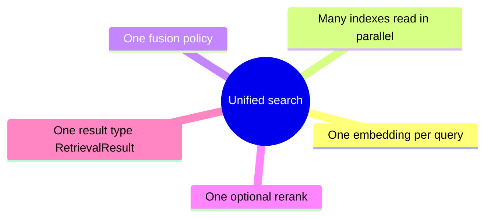

# Retrieval, fusion, and reranking (extended)

**`UnifiedSearchService`** is the **single entry** for hybrid search: it resolves **namespace** and **`RetrievalConfig`**, embeds the **query once**, runs **dense**, **sparse**, and **graph** retrieval (according to config), **fuses** ranked lists, and optionally **reranks**.

---

## 1. Orchestration overview

---

## 2. Namespace and config resolution

If **`namespace`** is omitted, the service defaults to the **user private namespace** string derived from **`Namespace(user_id).to_string()`**.

---

## 3. Parallel retrieval (fan-out)

**Filters:** Either a single **`filters`** dict for all paths, or **per-path** keys `dense`, `sparse`, `graph` inside the dict—implementation inspects structure before dispatch.

---

## 4. Fusion strategies (conceptual)

The **`fusion`** module provides **score normalization**, **reciprocal rank fusion (RRF)**, and **linear fusion**.

**RRF** is robust when raw scores are **not calibrated** across modalities. **Linear fusion** applies when you have **weights** and comparable normalized scores.

---

## 5. Reranking (second stage)

Rerankers (e.g. **BGE**, **Cohere**) are resolved via **`ProviderRegistry`** according to tenant/namespace configuration.

---

## 6. Dense retriever (role)

**`DenseRetriever`** queries the **vector store** with namespace-scoped collections and hydrates content via **`ContentStore`** as needed (pattern in implementation).

---

## 7. Sparse retriever (role)

Either **in-process BM25** (`SparseRetriever`) or **`ElasticSearchStore`** implementing the sparse protocol when Elasticsearch is configured.

---

## 8. Graph retriever (role)

**`GraphRetriever`** uses **graph store** operations (and may combine with vector signals depending on implementation) for multi-hop / PPR-style behavior—see `retrieval/graph.py` and graph store backend class.

---

## 9. Tracing boundary

---

## 10. Mental model: why “unified”

---

## Next

- [Storage and data plane](/docs/storage-data-plane) — how hits persist in stores.
- [API, tenants, auth, observability](/docs/api-tenants-auth-observability) — exposing search over HTTP.
- [Domain validation and quality](/docs/domain-validation-and-quality) — `RetrievalConfig` pointers and testing map.
