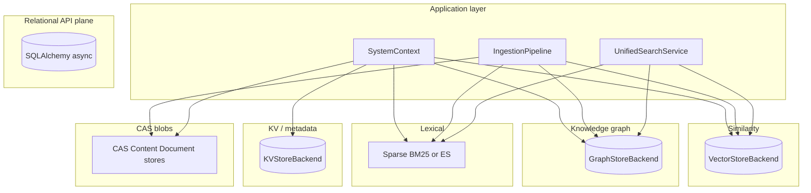
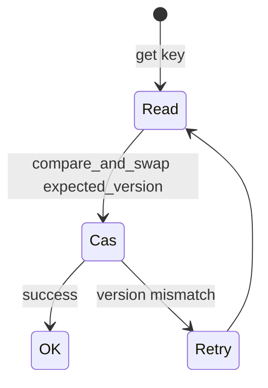
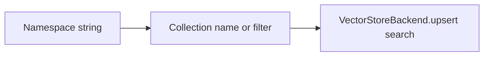
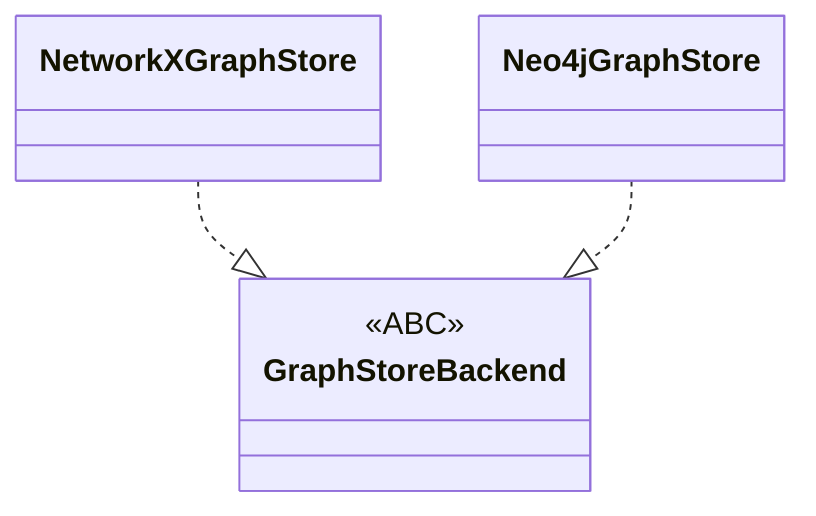
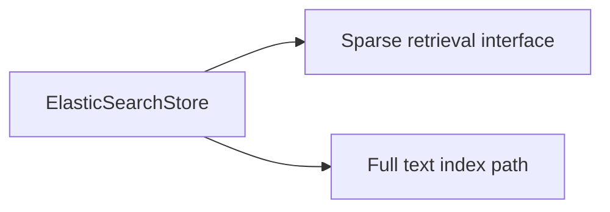
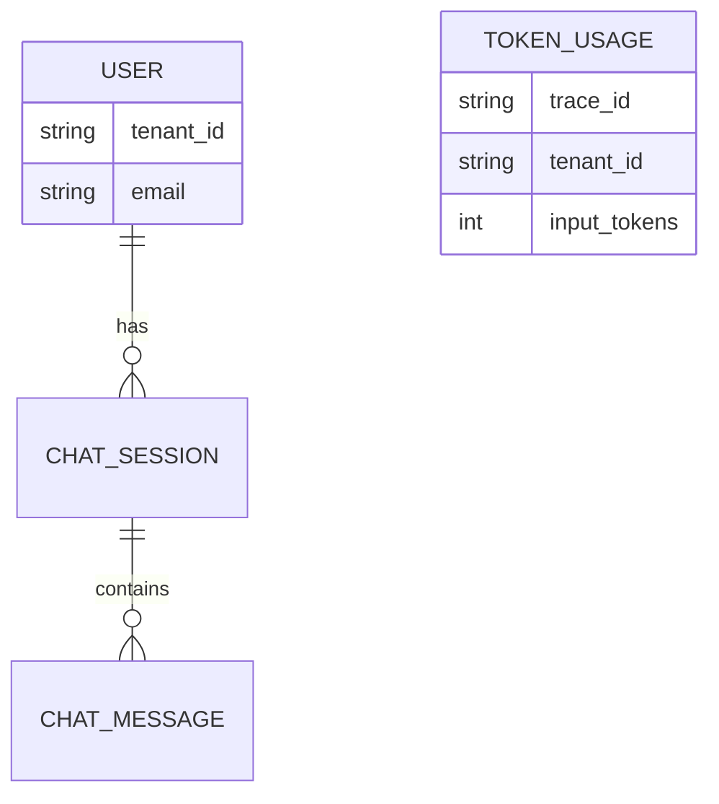
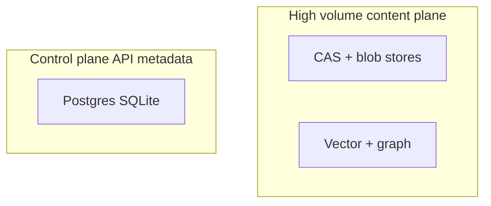
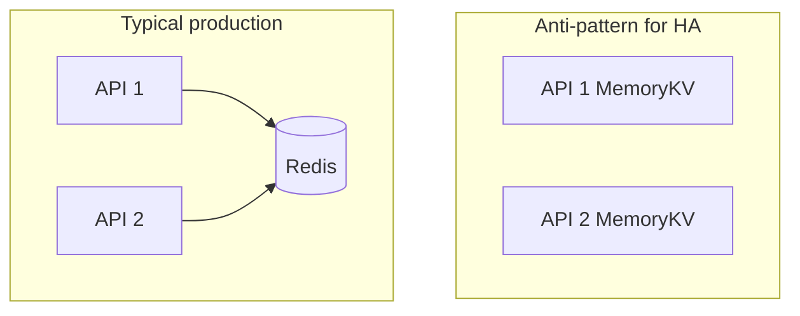

# Storage and data plane (extended)

This chapter visualizes **where state lives** and **which abstraction** owns it. Getting this wrong in operations (e.g. expecting Redis HA while using `memory`) is a common source of incidents.

---

## 1. Store roles (single picture)

---

## 2. KV: optimistic concurrency

**`KVStoreBackend`** exposes **versioned** values and **compare-and-swap** semantics—suitable for **namespace documents** and **registry** metadata under concurrent writers.

---

## 3. Vector: collections and namespaces

Vector backends implement **namespace-aware** routing (collections or metadata) so tenants do not leak embeddings across logical boundaries.

---

## 4. Graph: entities and relationships

---

## 5. Elasticsearch dual role

When **`sparse_retriever: elasticsearch`**, **`ElasticSearchStore`** may participate in **sparse retrieval** and related **content** indexing paths—**one** client instance is typically reused from **`SystemContext.elasticsearch_store`**.

---

## 6. SQL: who lives here

**Not** the primary content plane for chunk storage at scale—**users**, **chat sessions**, **messages**, **audit events**, and **token usage** rows.

---

## 7. CAS vs SQL (boundary)

**Rule of thumb:** if it must **join** with billing or **user identity** reliably, it’s a candidate for **SQL**; if it’s **content-addressed** and **deduped**, it’s **CAS/KV/vector**.

---

## 7b. CAS implementation split (chunk vs document vs image)

The **`cas`** package is not a single class:

| Piece | Role |
| --- | --- |
| **`ContentStore`** | Chunk-level **content-addressed** payloads (hash → bytes) used with vector/CAS registry |
| **`DocumentRegistry`**, **`CASRegistry`** | Refcounts, document ↔ namespace linkage, dedup **gates** |
| **`DocumentContentStore`** (`document_content_store.py`) | Optional **large document** blob storage (e.g. local FS) wired in **`build_services`** |
| **`ImageContentStore`** (`image_content_store.py`) | **Vision** / image bytes alongside text pipelines when configured |

Bootstrap wires **local FS** or **in-memory** variants for documents and **artifacts** for workflows; operators should confirm **disk paths** and **backup** for any FS-backed store.

---

## 8. Deployment: shared vs in-process stores

---

## Next

- [API, tenants, auth, observability](/docs/api-tenants-auth-observability) — HTTP surface over these stores.
- [Agents, workflows, and client apps](/docs/agents-workflows-and-apps) — artifact and document stores in workflow context.
