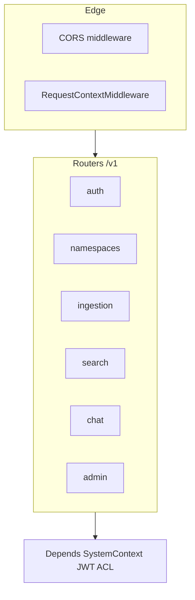
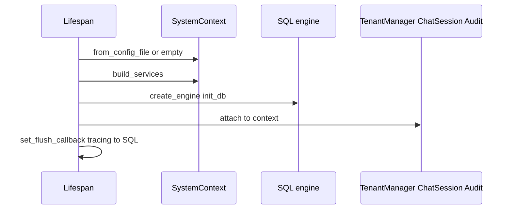
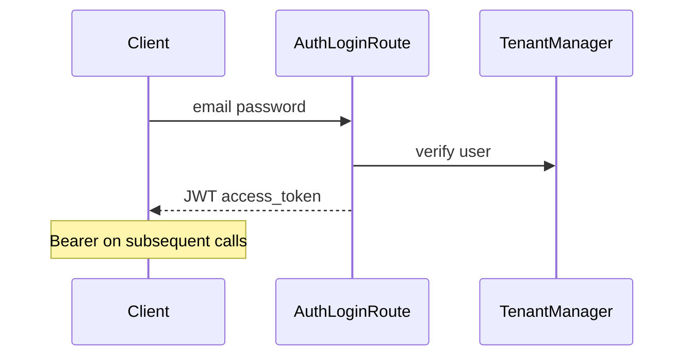
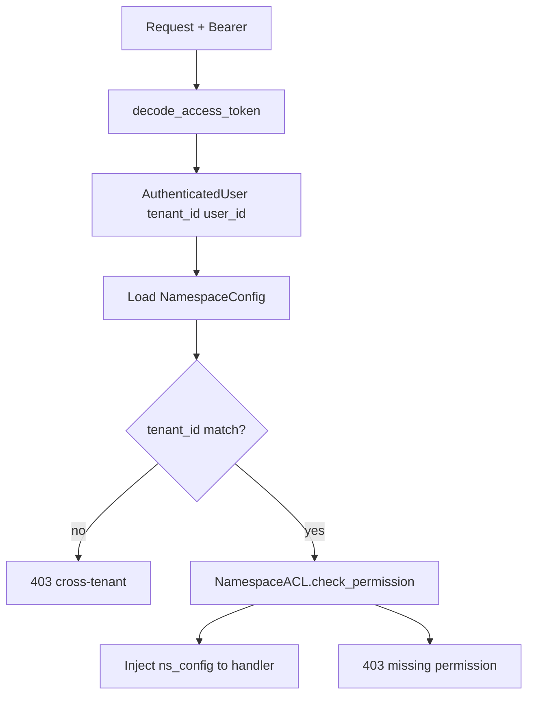
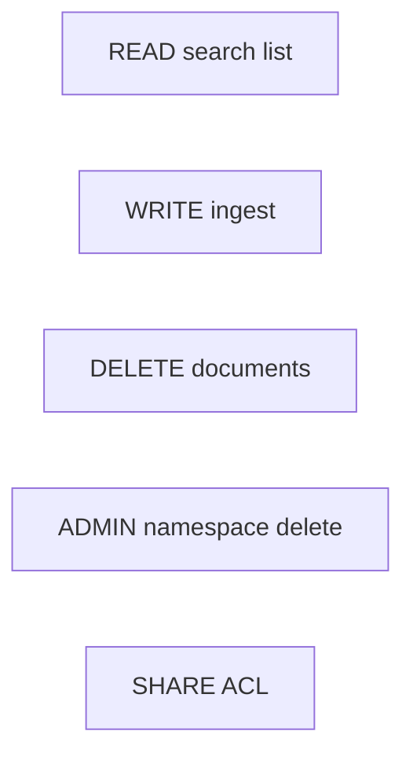
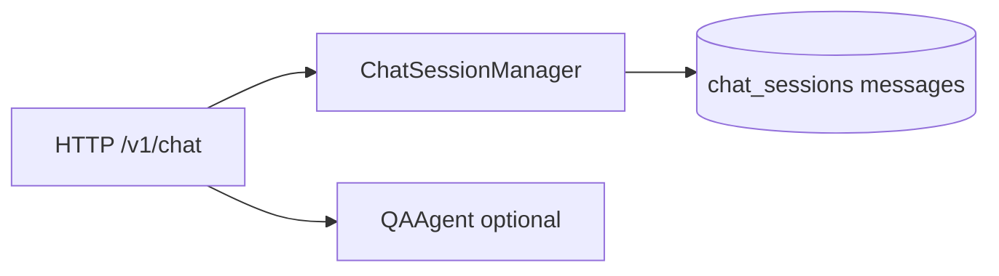
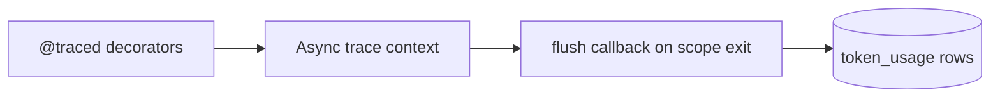
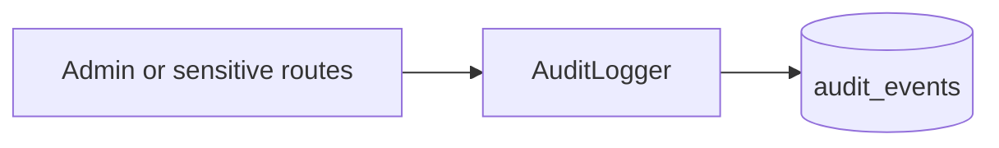
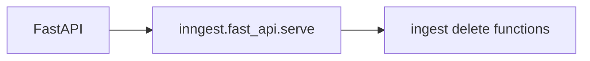
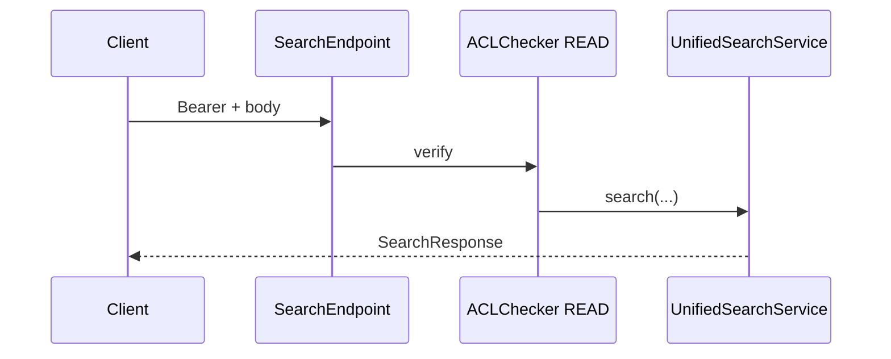

# API, tenants, auth, and observability (extended)

The **HTTP layer** adds **authentication**, **namespace ACLs**, **SQL-backed** chat and usage accounting, and **observability** hooks on top of the same **`SystemContext`** used in library mode.

---

## 1. FastAPI stack (layers)

---

## 2. Lifespan: what starts at boot

Typical environment variables (see **`docs/setup-and-configuration.md`** for the full list and `.env.example`):

| Variable | Role |
| --- | --- |
| **`UMS_CONFIG`** | Path or inline YAML/dict for `SystemContext` |
| **`UMS_DATABASE_URL`** | Async SQLAlchemy URL for users, chat, audit, usage |
| **`UMS_JWT_SECRET`** | Signing secret for access tokens |
| **`UMS_ENABLE_INNGEST`** | Opt-in Inngest client + `serve()` wiring |
| **`OPENAI_API_KEY`** / provider keys | Embeddings, LLM, extractors when using OpenAI-backed providers |

---

## 3. JWT authentication (conceptual)

---

## 4. ACL dependency (`ACLChecker`)

Routes that carry a **namespace** path use **`ACLChecker(Permission.X)`** after **`get_current_user`**.

**Public namespaces:** if **`ns_config.scope == "public"`** and the route requires **`Permission.READ`** only, **`ACLChecker`** returns the config **without** listing the user on the namespace ACL. **WRITE**, **DELETE**, **ADMIN**, and **SHARE** still require explicit ACL grants. See **`api/deps.py`**.

---

## 5. Permission lattice (simplified)

---

## 6. Chat and SQL dependency

Chat endpoints require **`chat_session_manager`**; if SQL is not configured, handlers return **501** (“Chat sessions not configured”).

---

## 7. Tracing and token usage flush

---

## 8. Audit trail

**`AuditLogger`** persists **security-relevant** actions to **`audit_events`** for investigations.

---

## 9. Inngest registration (optional)

On startup, if Inngest client and functions exist, the app may register **`inngest.fast_api.serve`**.

---

## 10. End-to-end: authenticated search call

---

## Cross-links (canonical Markdown in repo)

These pages live under `docs/` next to this MDX site (not served by Docusaurus by default):

- `docs/rest-api-reference.md` — REST route table
- `docs/security-deployment-and-operations.md` — security and operations
- `docs/setup-and-configuration.md` — environment and YAML reference

## Next

- [Agents, workflows, and client apps](/docs/agents-workflows-and-apps) — QAAgent, Inngest, Streamlit client.
- [Domain validation and quality](/docs/domain-validation-and-quality) — namespace grammar and quality gates.
