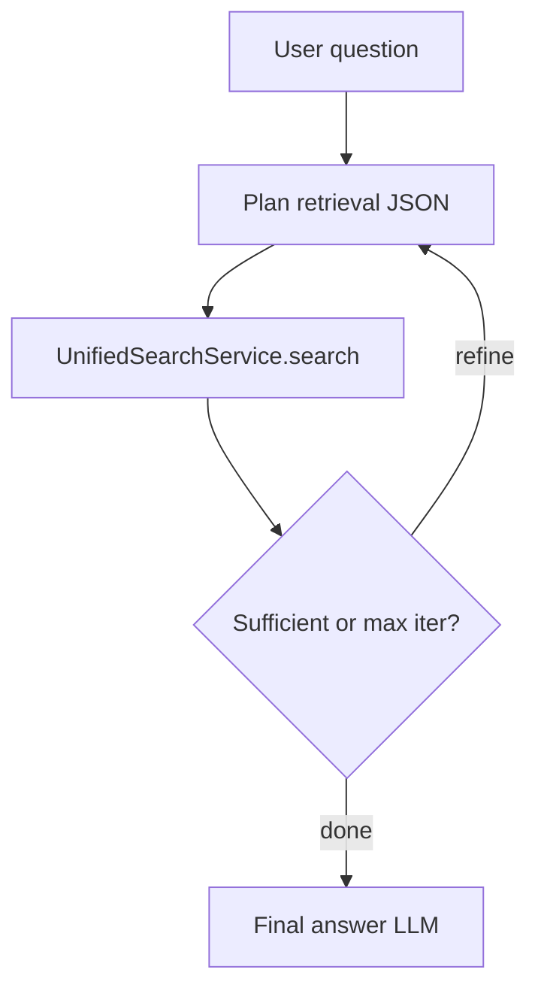
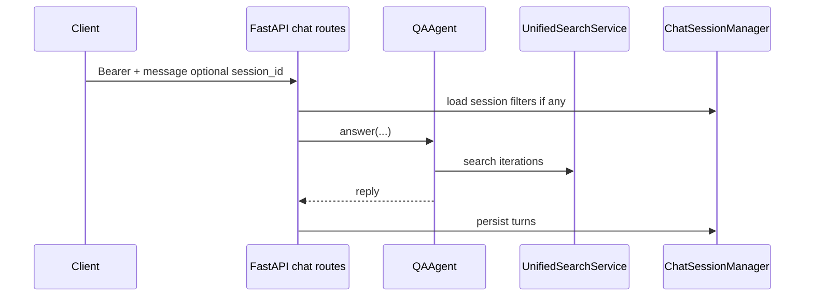
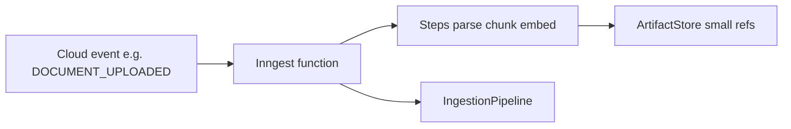

# Agents, workflows, and client apps (extended)

The **library core** (`IngestionPipeline`, `UnifiedSearchService`) is intentionally **HTTP-agnostic**. This chapter covers **higher-level automation** built on top: the **QAAgent** ReAct loop, **Inngest** durable workflows, and the **Streamlit** demo as a reference **HTTP client**—topics that were only hinted at in the system overview and bootstrap chapters.

---

## 1. QAAgent: plan → search → answer

**Location:** `unified_memory/agents/qa_agent.py`

The agent runs a **bounded** (default **three** iterations) loop: **plan** retrieval (JSON from the LLM), **execute** `UnifiedSearchService.search`, **assess** sufficiency, optionally **reformulate**, then **generate** a grounded final answer.

**Hard dependencies:** `UnifiedSearchService`, `NamespaceManager`, `ProviderRegistry` (LLM resolution).

**Optional:** `ChatSessionManager` — when a **`session_id`** is present, the agent can apply **session-scoped document filters** so answers stay within uploaded context for that thread.

**Tracing:** the public **`answer(...)`** entrypoint is wrapped with **`@traced("agent.answer")`** so token usage flows into the same observability path as search and ingestion.

---

## 2. Context budgeting (tokenizer)

**`core/tokenizer.py`** defines **`ContextWindowManager`**: estimate **token** usage for prompts and trim or budget context so the agent and chat paths stay within model limits. This is **not** shown on every sequence diagram but is part of the **agent stack** alongside the LLM provider.

---

## 3. Chat API vs library-only use

**`api/routes/chat.py`** wires HTTP clients to **`ctx.qa_agent`**. **`ChatSessionManager`** (`storage/sql/session_manager.py`) persists **sessions** and **messages** when SQL is configured; otherwise chat routes respond with **501** (not configured).

---

## 4. Inngest workflows (optional)

**Modules:** `unified_memory/workflows/` — client, events, **`LocalFSArtifactStore`**, ingest/delete **functions**, job state, serialization.

**Why it exists:** HTTP uploads can **timeout** on large documents; **durable steps** with **retries** and **per-tenant concurrency** move heavy work off the request thread while still calling the **same** `IngestionPipeline`.

**Delete path:** a matching **`DOCUMENT_DELETE_REQUESTED`** event can **cancel** an in-flight ingest for the same logical document (see `workflows/delete_function.py` and event constants in `workflows/events.py`).

**Bootstrap:** `SystemContext._setup_inngest()` attaches **`_inngest_client`** and **`_inngest_functions`**; **`api/app.py`** may register **`inngest.fast_api.serve`** when enabled (**`UMS_ENABLE_INNGEST`**, `build_services(enable_inngest=True)`).

---

## 5. Artifact externalization (mental model)

Step outputs in workflow engines are often **persisted** and **replayed**. Storing **multi-megabyte** parse results inline **bloats** state. **`ArtifactStore`** holds **blob paths** or opaque refs; steps pass **handles** only.

---

## 6. Streamlit demo (`apps/streamlit_demo`)

The demo is a **thin HTTP client** — it does **not** import pipeline code for business logic. It exercises **login**, **namespaces**, **document upload**, **chat**, and **admin** pages against the same REST API production clients use.

| Path | Role |
| --- | --- |
| `apps/streamlit_demo/app.py` | Multipage entry, session state (`api_token`, `api_base_url`, `tenant_id`) |
| `apps/streamlit_demo/api_client.py` | `MemoryAPIClient` — auth + API wrapper |
| `apps/streamlit_demo/pages/*.py` | Feature pages |

**Default API base:** `http://localhost:8000` (configurable in the UI).

---

## 7. Devil’s advocate: what this chapter still omits

- **Prompt text** and **JSON schemas** for the agent’s planner live in source; they change with releases.
- **Inngest Cloud** vs self-hosted **dev server** specifics belong in **deployment** runbooks (`docs/security-deployment-and-operations.md`).
- **Third-party Streamlit hosting** (auth, secrets) is outside this repository.

---

## Next

- [Domain validation and quality](/docs/domain-validation-and-quality) — namespace grammar, JSON repair, embedding cache, testing pointers.
- Canonical detail: **`docs/agents-and-chat.md`**, **`docs/workflows.md`**, **`docs/apps-streamlit-demo.md`** (repo Markdown; not part of the Docusaurus site bundle).
