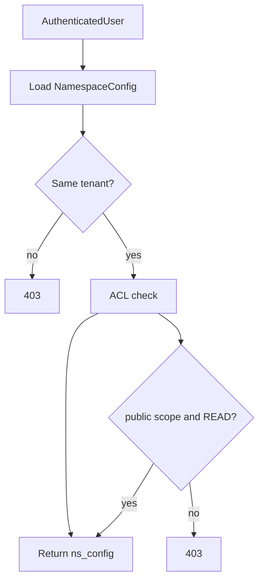
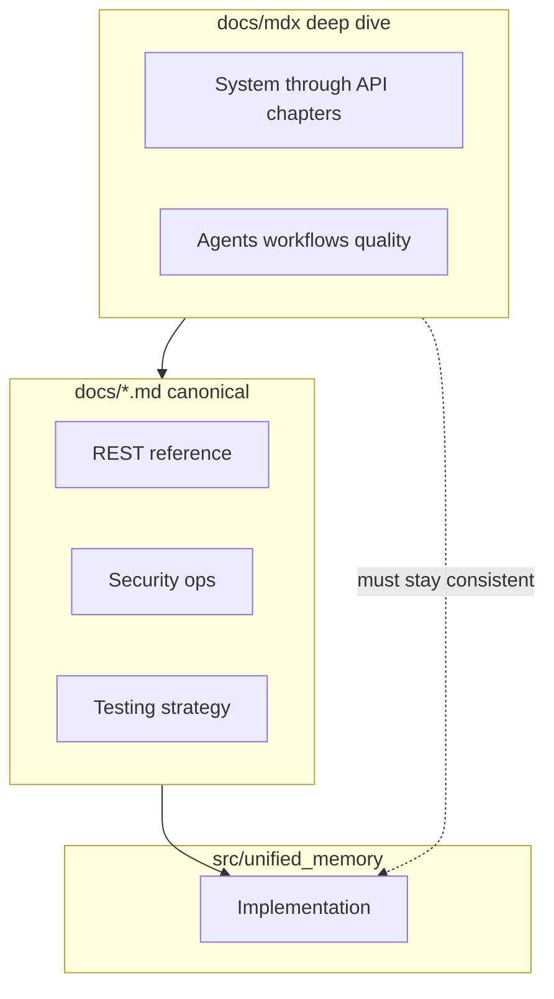

# Domain validation and quality (extended)

Earlier MDX chapters focus on **flows** and **stores**. This one closes gaps around **identifiers**, **robust parsing** of LLM output, **performance** (embedding cache), and **verification**—so operators and contributors know where **invariants** are enforced and where to read **full API tables** and **test strategy**.

---

## 1. Namespace identifier grammar

**`namespace/validation.py`** — **`validate_namespace_id`**

Canonical segments (minimum **`tenant:{id}/user:{id}`**, optional **`agent:`** then **`session:`** in that order):

```text
tenant:{tenant_id}/user:{user_id}[/agent:{agent_id}][/session:{session_id}]
```

Component IDs allow **alphanumeric**, **underscore**, **hyphen**, and **dot**. Violations raise **`ValueError`** — used when APIs or admin paths accept raw namespace strings.

**Relationship to `Namespace` types:** the **`Namespace`** helper in **`core.types`** builds the same logical shape; validation ensures **external** strings (HTTP paths, CLI) match before hitting **`NamespaceManager`**.

---

## 2. ACL recap: public scope and READ

**`api/deps.py`** — **`ACLChecker`**

After **cross-tenant** checks and **namespace + inherited tenant ACL** evaluation, a namespace with **`scope == "public"`** allows **`Permission.READ`** without listing the user on the ACL. **WRITE**, **DELETE**, **ADMIN**, and **SHARE** still require explicit grants.



---

## 3. Structured LLM output: extraction and JSON repair

**`LLMExtractor`** (`ingestion/extractors/llm_extractor.py`) asks the LLM for JSON with **`entities`** and **`relations`** keys. **`generate_structured`** returns text that may still include **markdown fences** or minor syntax errors.

**`core/json_utils.py`** provides **`validate_and_repair_json`** (backed by **`json-repair`**) and **`clean_json_response`** so extraction **degrades gracefully**: on failure, the pipeline returns an **empty** `ExtractionResult` rather than failing the whole ingest.

---

## 4. Embedding cache

**`embeddings/cache.py`** — **`CachedEmbeddingProvider`**

Wraps any **`EmbeddingProvider`** with a cache keyed by **content hash** (and model identity in the keying strategy), optionally backed by **in-memory dict** or **KV** for cross-request reuse. This reduces **cost** and **latency** when the same chunk text is embedded repeatedly (re-ingest, dedup paths, dev loops).

---

## 5. RetrievalConfig (where behavior is decided)

**`RetrievalConfig`** (see **`core/types.py`** and namespace config documents) drives **which** retrievers run, **fusion** mode, **reranker** choice, and **top-k** / limits per path. **`UnifiedSearchService`** resolves it per tenant/namespace — the retrieval MDX chapter shows orchestration; **field-by-field** semantics stay in **`docs/retrieval-and-search.md`** and **`docs/domain-model-and-types.md`** to avoid duplication drift.

---

## 6. Testing and quality gates

The **MDX** site does **not** replace **`docs/testing-strategy.md`**: unit vs integration layout, **`docker-compose.test.yml`**, and markers belong there.

**Devil’s advocate checklist** before merging behavior changes:

- Run **unit** tests for the touched package.
- If stores or HTTP contracts change, run **integration** tests that exercise **real** or **Testcontainers** backends as documented.

---

## 7. Canonical Markdown map (single source of truth)

These **`.md`** files under `docs/` remain authoritative for **tables**, **checklists**, and **versioned procedures**:

| Topic | Canonical file |
| --- | --- |
| Full REST route matrix | `docs/rest-api-reference.md` |
| Security, TLS, CORS, backups | `docs/security-deployment-and-operations.md` |
| Setup, env vars, YAML | `docs/setup-and-configuration.md` |
| Class hierarchies | `docs/inheritance-class-diagrams.md` |
| Glossary | `docs/glossary.md` |

Use **this MDX tree** for **narrative + diagrams**; when the two disagree, **trust code**, then **update both**.

---

## 8. Figure: documentation layers



---

## Next

- [Configuration matrix](/docs/configuration-matrix) — YAML keys, **`${VAR}`** interpolation, and what the API reads from the environment.
- Loop back to [System overview](/docs/system-overview) or open the repo **`docs/README.md`** for the full reading order.
- Terminology: **`docs/glossary.md`** (canonical; not rendered by the Docusaurus app by default).
