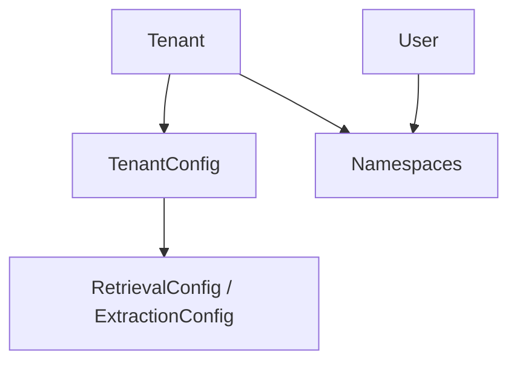
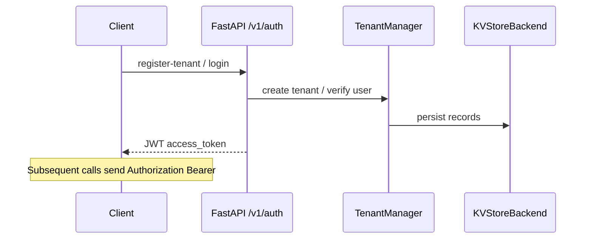

# Namespaces, tenants, and authentication

## Concepts

- **Tenant** — Top-level isolation boundary for configuration (embedding models, LLM, chunking, retrieval defaults, quotas). Persisted via **`TenantManager`** (`namespace/tenant_manager.py`).
- **Namespace** — String identifier (often derived from `Namespace(user_id=...).to_string()`) scoped under a tenant; used for **vector collection routing**, **graph partitioning**, and **retrieval config**.
- **User** — Authenticated principal; JWT carries identity used by routes and default namespace resolution.

## Namespace manager

**`NamespaceManager`** (`namespace/manager.py`) loads and validates **namespace configuration** from the KV store, applies **hierarchical overrides** (tenant → namespace), and exposes async getters used by ingestion and search.

**Types** live in `namespace/types.py` (`Namespace`, `TenantConfig`, `RetrievalConfig`, embedding model configs, etc.).

## Tenant manager

**`TenantManager`** registers tenants, associates users, and stores **per-tenant defaults** and overrides. The HTTP API uses it during **`/v1/auth/register-tenant`** and related flows.

## Authentication

| Piece | Location |
| --- | --- |
| Password hashing | `auth/password.py` |
| JWT create/verify | `auth/jwt_handler.py` |
| HTTP dependencies | `api/deps.py` (`get_system_context`, `get_current_user`, secrets) |

Routes under `api/routes/auth.py` include tenant registration, user registration, and login returning **`TokenResponse`**.

## Request context middleware

**`api/middleware/context.py`** — `RequestContextMiddleware` attaches request-scoped data (for tracing and tenant/user correlation).

## Default namespace behavior

When **`UnifiedSearchService.search`** is called **without** a namespace, it defaults to the **user’s private namespace** string (`Namespace(user_id=user_id).to_string()` in `retrieval/unified.py`). Ingestion routes typically require explicit namespace or derive it from context.

## Diagram: auth to system context

## ACL enforcement (HTTP)

Namespace routes use **`ACLChecker`** with **`Permission`** (`READ`, `WRITE`, `DELETE`, `ADMIN`, `SHARE`). Resolution uses **`NamespaceACL`** (deny-over-allow, tenant inheritance). Details: [domain-model-and-types.md](./domain-model-and-types.md#permissions-and-acl), implementation [`api/deps.py`](../src/unified_memory/api/deps.py).

## Related

- [rest-api-reference.md](./rest-api-reference.md) — which routes require which permission
- [security-deployment-and-operations.md](./security-deployment-and-operations.md) — JWT and deployment
