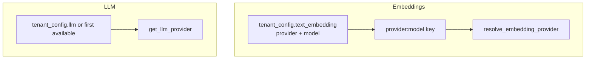
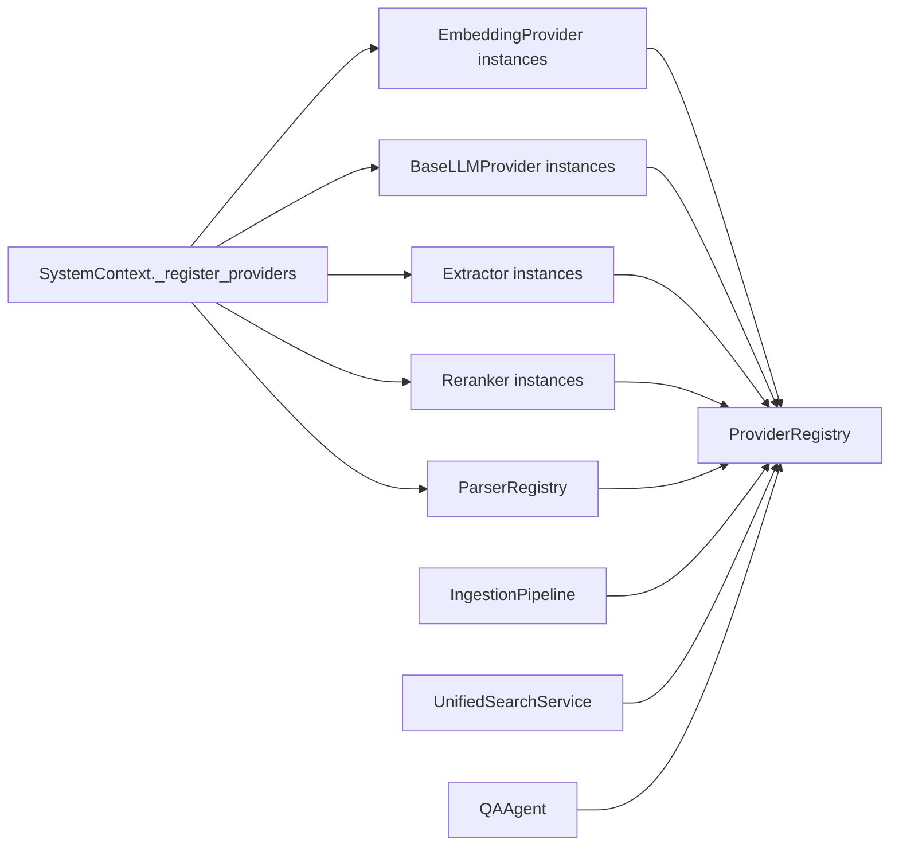

# Providers and registry

## `ProviderRegistry`

**Location:** `unified_memory/core/registry.py`

The registry holds **singleton-style** instances registered at bootstrap:

- **Text embedding providers** — keys like `openai:text-embedding-3-small`
- **Vision embedding providers** — separate dict; same key pattern but registered with `modality: vision` / `image` in YAML
- **LLM providers** — keys `provider:model`, used by extractors and `QAAgent`
- **Extractors** — string keys from config (`mock`, `llm-default`, …)
- **Rerankers** — resolved at search time from tenant/namespace config
- **Parsers** — internal `ParserRegistry` (see `ingestion/parsers/registry.py`); bootstrap registers `TextParser` and optionally `MinerUPDFParser`

Registered providers are **not replaced** if the same key is registered twice (idempotent registration).

## Key resolution conventions

## Embedding providers

**Abstract base:** `unified_memory/embeddings/base.py` — class **`EmbeddingProvider`** (`ABC`).

**Implementations** (typical): `MockEmbeddingProvider`, `OpenAIEmbeddingProvider`, and others registered in `SystemContext._build_embedding_provider`.

YAML `modality` routing:

- `text` (default) → `register_embedding_provider`
- `vision` / `image` → `register_vision_embedding_provider`

## LLM providers

**Abstract base:** `unified_memory/llm/base.py` — **`BaseLLMProvider`** with `generate`, `generate_structured`, and optional `generate_with_images` for multimodal models (`supports_images`).

**Implementation:** `OpenAIProvider` in `llm/openai_provider.py` (wired from `_build_llm_provider`).

## Interface ownership

The old duplicate protocols for **`EmbeddingProvider`**, **`LLMProvider`**, **`DocumentParser`**, and **`Chunker`** were removed from `core/interfaces.py`.

Current source of truth:

- `embeddings/base.py` → `EmbeddingProvider` (`ABC`)
- `llm/base.py` → `BaseLLMProvider` (`ABC`)
- `ingestion/parsers/base.py` → `DocumentParser` (`ABC`)
- `ingestion/chunkers/base.py` → `Chunker` (`ABC`)

`core/interfaces.py` now only keeps protocol-only contracts that do not have competing ABCs, primarily `Reranker` and `SparseRetriever`.

## Extractors

**Abstract base:** `ingestion/extractors/base.py` — **`Extractor`** with `async def extract(chunk) -> ExtractionResult`.

Registered by key; LLM-backed extractors receive references to registered LLM instances from `_register_providers`.

## Rerankers

Configured under `rerankers:` in YAML; implementations are constructed in `_build_reranker` (BGE, Cohere, etc., depending on extras installed).

## Parsers

**Abstract base:** `ingestion/parsers/base.py` — **`DocumentParser`** (`ParsedDocument`, `parse(...)`, extension/MIME metadata).

Bootstrap registers parsers **eagerly** so `get_parser_for_file` works before the pipeline runs.

## Diagram: registry at the center

