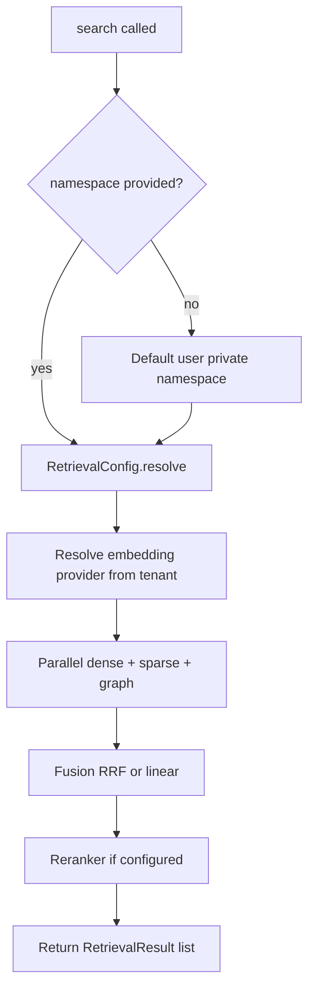
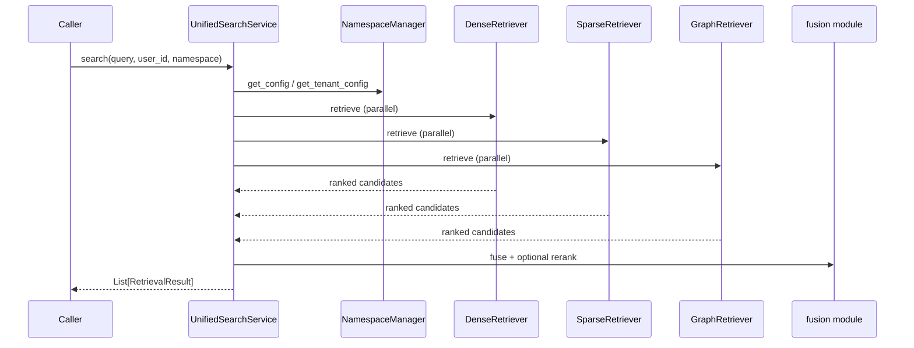

# Retrieval and search

**Primary type:** `unified_memory.retrieval.unified.UnifiedSearchService`

Search is **unified** in the sense that a single call can combine:

1. **Dense** vector retrieval (`DenseRetriever`)
2. **Sparse** lexical retrieval (BM25 in-process or **Elasticsearch**)
3. **Graph** retrieval (`GraphRetriever`)

…then **fuse** scores and optionally **rerank**.

## Entry point

`UnifiedSearchService.search(query, user_id, namespace?, config?, request_options?, target_namespaces?, filters?)`

### Resolution order (simplified)

Namespace and tenant configuration come from **`NamespaceManager`** (`namespace/manager.py`); retrieval knobs are in **`RetrievalConfig`** (`namespace/types.py`).

## Retriever modules

| Module | Class | Responsibility |
| --- | --- | --- |
| `retrieval/dense.py` | `DenseRetriever` | Vector similarity over namespace-scoped collections |
| `retrieval/sparse.py` | `SparseRetriever` | In-memory BM25 when ES is not used |
| `retrieval/sparse_bm25.py` | (implementation detail) | BM25 indexing/search helpers |
| `retrieval/graph.py` | `GraphRetriever` | Graph walks / expansion using graph + optional vector joins |
| `retrieval/fusion.py` | `reciprocal_rank_fusion`, `linear_fusion`, `normalize_scores` | Combine ranked lists |

`storage/search/elasticsearch_store.py` implements the **`SparseRetriever`** protocol when Elasticsearch is the sparse backend.

## Fusion strategies

Configured per tenant/namespace; implementation in `fusion.py`:

- **Reciprocal Rank Fusion (RRF)** — robust merge of multiple ranked lists without raw score calibration.
- **Linear fusion** — weighted combination after score normalization.

## Reranking

If a reranker key is configured and resolved through **`ProviderRegistry`**, candidates are re-ordered using a cross-encoder or API reranker (`core/interfaces.py` **`Reranker`** protocol).

## Tracing

`@traced("search.unified")` wraps the main search path for observability.

## Sequence: unified search

## Filters and multi-namespace

The service supports **`target_namespaces`** and structured **`filters`** for scoped search; see unit tests in `tests/unit/retrieval/test_unified_filters_and_fusion.py` for expected behavior.
