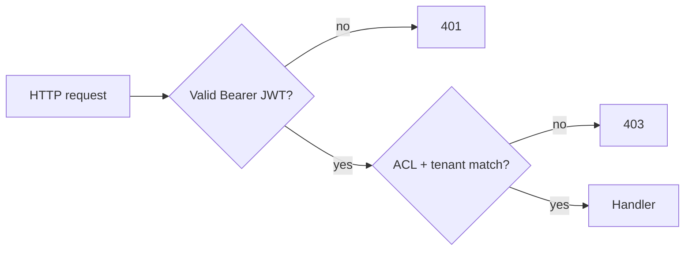
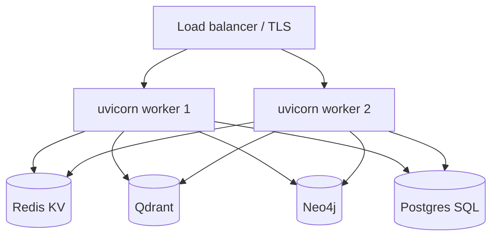

# Security, deployment, and operations

This document collects **operational** guidance for running Unified Memory System in a realistic environment. It is not a formal security audit.

## Threat model (brief)

| Asset | Risk if compromised |
| --- | --- |
| **`UMS_JWT_SECRET`** | Forged tokens; full API impersonation |
| **SQL DB** (`UMS_DATABASE_URL`) | User passwords (hashed), chat content, audit logs, usage |
| **KV / vector / graph / ES** | Tenant data at rest; cross-tenant reads if misconfigured |
| **Provider API keys** (OpenAI, etc.) | Billing abuse, data exfiltration via model calls |

## Authentication and authorization

- **JWT:** HS256-style signing with **`UMS_JWT_SECRET`**. Use a **long random secret** in production; rotate with a planned re-login for all clients.
- **Passwords:** Hashed via **`passlib`** / bcrypt in auth routes ([`auth/password.py`](../src/unified_memory/auth/password.py)).
- **ACL:** **`ACLChecker`** enforces namespace permissions and **blocks cross-tenant** namespace access ([`api/deps.py`](../src/unified_memory/api/deps.py)).

## Transport

- **Development:** HTTP is typical. **Production:** terminate **TLS** at a reverse proxy (nginx, Envoy, cloud LB) or run uvicorn behind HTTPS.
- **CORS:** `api/app.py` uses **`allow_origins=["*"]`** — **replace** with explicit origins before exposing to the internet.

## Configuration hygiene

| Practice | Detail |
| --- | --- |
| Separate configs | Use different YAML files per environment; never commit real secrets |
| Env substitution | `config/app.example.yaml` uses `${VAR}` style placeholders — ensure env is injected in prod |
| Database | Prefer **managed Postgres** (async driver) over SQLite for multi-worker / HA |
| File artifacts | Artifact/image/document stores default under **`/tmp`** — set **`artifact_store_dir`** for persistent, secured volumes |

## Scaling and process model

- **Multiple API replicas** require **shared** KV, vector, graph, and SQL — **not** in-memory backends.
- **SQLite** does not handle concurrent writers across processes; use **Postgres** (or similar) for the SQL layer.
- **Inngest:** workflow workers must reach the same logical pipeline configuration; coordinate **`UMS_ENABLE_INNGEST`** and Inngest app IDs.

## Observability in production

- **Tracing:** `@traced` spans and **token usage** flush to **`token_usage`** — monitor DB growth and add retention policies.
- **Audit:** **`audit_events`** for security investigations.
- **Logs:** `structlog` is a dependency of the server extra; aggregate logs centrally (JSON to stdout is a common pattern).
- **Prometheus:** `prometheus-client` is included in **`server`** extra — expose metrics behind auth if needed.

## Backup and disaster recovery

| Store | Suggestion |
| --- | --- |
| **SQL** | Regular snapshots / PITR per your DB vendor |
| **Redis** | RDB/AOF persistence if KV is source of truth for namespaces |
| **Qdrant / Neo4j / ES** | Follow vendor backup docs; test restore |
| **CAS / artifact dirs** | Filesystem snapshots or object storage replication |

## Pre-production checklist

- [ ] Strong **`UMS_JWT_SECRET`**
- [ ] Restricted **CORS** origins
- [ ] **HTTPS** at the edge
- [ ] Non-default **`UMS_DATABASE_URL`** with backups
- [ ] Shared durable backends if **>1** API instance
- [ ] API keys in **secrets manager**, not in git
- [ ] Review **admin** routes and disable or protect if unused

## Related

- [setup-and-configuration.md](./setup-and-configuration.md)
- [rest-api-reference.md](./rest-api-reference.md)
- [api-http-and-observability.md](./api-http-and-observability.md)
