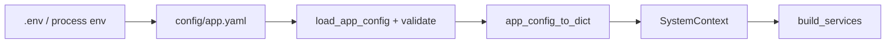

# Setup and configuration

## Requirements

- **Python**: `>= 3.10` (see `pyproject.toml`).
- **Install modes**: the core library has a small default dependency set; optional backends and the HTTP server are **extras**.

## Install the package (editable)

From the repository root:

```bash
pip install -e ".[dev]"
```

For a **full local stack** closer to production (vector DB, graph, ES, OpenAI, rerankers, PDF, workflows):

```bash
pip install -e ".[server,streamlit]"
```

Or install everything optional except heavy MinerU:

```bash
pip install -e ".[all,workflows,server,streamlit]"
```

Refer to `[project.optional-dependencies]` in `pyproject.toml` for the exact groups: `dev`, `databases`, `openai`, `rerankers`, `pdf`, `mineru`, `workflows`, `all`, `server`, `streamlit`.

## Environment variables

Copy `.env.example` to `.env` and adjust. Variables used by the API and bootstrap include:

| Variable | Purpose |
| --- | --- |
| `UMS_CONFIG` | Path to YAML app config (default `config/app.example.yaml`) |
| `UMS_JWT_SECRET` | Secret for signing JWT access tokens |
| `UMS_TOKEN_EXPIRE_MINUTES` | JWT lifetime (API reads this in `api/app.py`) |
| `UMS_DATABASE_URL` | Async SQLAlchemy URL (default SQLite file) |
| `UMS_ENABLE_INNGEST` | `1`/`true` to wire Inngest client and workflow functions at startup |
| `REDIS_URL`, `QDRANT_URL`, `NEO4J_*`, `ELASTICSEARCH_*` | Substituted into YAML when using those backends |
| `OPENAI_API_KEY`, `OPENAI_BASE_URL` | OpenAI-compatible APIs for embeddings and LLMs |

## YAML application configuration

`config/app.example.yaml` is the reference. It defines:

1. **`infra`**: Which concrete backends to use:
   - `kv_store`: `memory` | `redis`
   - `vector_store`: `memory` | `qdrant`
   - `graph_store`: `networkx` | `neo4j`
   - `sparse_retriever`: `bm25` (in-process) | `elasticsearch`

2. **`embedding_providers`**: Named keys (typically `provider:model`) with `modality: text` or `vision`/`image`.

3. **`llm_providers`**: Chat models for extraction and QA.

4. **`extractors`**: Mock vs LLM-backed extractors referencing `llm_provider` keys.

5. **`rerankers`**: e.g. BGE local or Cohere.

`SystemContext.from_config_file(path)` loads this via `unified_memory.core.config`, validates compatibility, and converts it to the dict shape expected by `SystemContext.__init__`.

## Running the HTTP API

Install the `server` extra, then:

```bash
export UMS_CONFIG=config/app.example.yaml
uvicorn unified_memory.api.app:app --reload
```

Health check: `GET /health`.

## Running the Streamlit demo

Install the `streamlit` extra, then from `apps/streamlit_demo` (or with `PYTHONPATH` set to `src`):

```bash
streamlit run app.py
```

See [apps-streamlit-demo.md](./apps-streamlit-demo.md).

## Docker / integration tests

`docker-compose.test.yml` is used to bring up dependencies for integration tests (see [testing-strategy.md](./testing-strategy.md)).

## Configuration flow (diagram)



## Production notes

- **SQL:** Use a managed **PostgreSQL** (or similar) with an async driver in `UMS_DATABASE_URL` for multiple API workers and durability. SQLite is convenient for development only.
- **Secrets:** Keep API keys and `UMS_JWT_SECRET` in a secrets manager or environment injected by the orchestrator—never commit them.
- **CORS:** Restrict origins in `api/app.py` before internet exposure (see [security-deployment-and-operations.md](./security-deployment-and-operations.md)).
- **Streamlit:** When running `streamlit run` from `apps/streamlit_demo`, ensure **`PYTHONPATH`** includes the repo `src` if imports fail, or run from an environment where the package is installed editable.

## Troubleshooting

- **Missing optional dependency**: Install the matching extra (e.g. `qdrant-client` for Qdrant).
- **Invalid YAML / incompatible infra**: Startup will fail validation in `from_config_file`; fix `infra` and provider sections.
- **SQLite path**: Default DB file is created relative to the process CWD; set `UMS_DATABASE_URL` explicitly in production.
- **Chat returns 501**: The API must initialize SQL and attach `chat_session_manager` to `SystemContext`; check `UMS_DATABASE_URL` and startup logs.

## Related

- [architecture-overview.md](./architecture-overview.md) — deployment topology
- [security-deployment-and-operations.md](./security-deployment-and-operations.md) — full checklist
