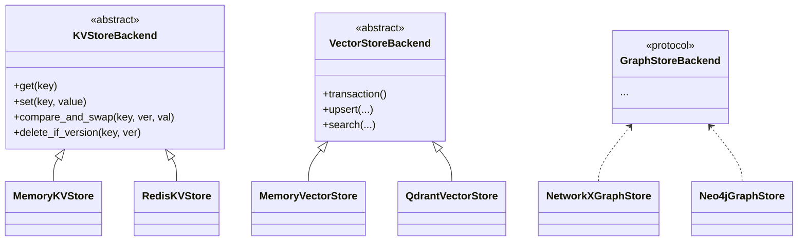

# Storage and content-addressable storage (CAS)

This system separates **logical memory** into several **storage roles**. Implementations are swappable via `SystemContext` configuration.

## Storage abstractions (`storage/base.py`)

### `KVStoreBackend` (ABC)

**Optimistic concurrency** with **`VersionedValue`** and **`compare_and_swap`**. Used for:

- Namespace and tenant metadata
- CAS registry entries
- Document registry records

**Implementations:** `storage/kv/memory_store.py`, `storage/kv/redis_store.py`

### `VectorStoreBackend` (ABC)

Namespace-aware vector upsert/search with optional **`transaction()`** context for batched writes.

**Implementations:** `storage/vector/memory_store.py`, `storage/vector/qdrant.py`

### `GraphStoreBackend` (Protocol)

Structural subtyping: concrete graph backends implement the protocol methods expected by **`GraphRetriever`** and ingestion.

**Implementations:** `storage/graph/networkx_store.py`, `storage/graph/neo4j.py`

### Sparse / full-text

- **In-process BM25** — `retrieval/sparse.py` when Elasticsearch is not configured.
- **`ElasticSearchStore`** — `storage/search/elasticsearch_store.py` when `sparse_retriever: elasticsearch`; may also participate in content indexing depending on pipeline configuration.

## CAS layer

| Component | Path | Purpose |
| --- | --- | --- |
| `CASRegistry` | `cas/registry.py` | Content-hash registry, reference counting |
| `ContentStore` | `cas/content_store.py` | Stores and retrieves payload bytes by hash |
| `DocumentRegistry` | `cas/document_registry.py` | Maps document hashes to metadata and namespace membership |
| `document_content_store` / `image_content_store` | `cas/document_content_store.py`, `cas/image_content_store.py` | Filesystem-backed large blobs |

Deduplication ensures the same **content hash** can be shared across namespaces with correct **unlink** semantics on delete (see integration tests `test_dedup_flow.py`, `test_delete_flow.py`).

## SQL layer (`storage/sql/`)

Used by the **API** for:

- **Chat sessions** — `ChatSessionManager`
- **Token usage** — flushed from tracing context
- **Audit** — `AuditLogger`

Engine creation: `storage/sql/engine.py`; ORM models: `storage/sql/models.py`.

## Class / protocol diagram (storage)

## Choosing backends

| Goal | Suggested combo |
| --- | --- |
| Unit tests / CI | `memory` + `networkx` + BM25 |
| Single-machine dev with persistence | `redis` + `qdrant` + `neo4j` + optional ES |
| Full-text at scale | Elasticsearch for `sparse_retriever` |

See [setup-and-configuration.md](./setup-and-configuration.md) for environment variables.
