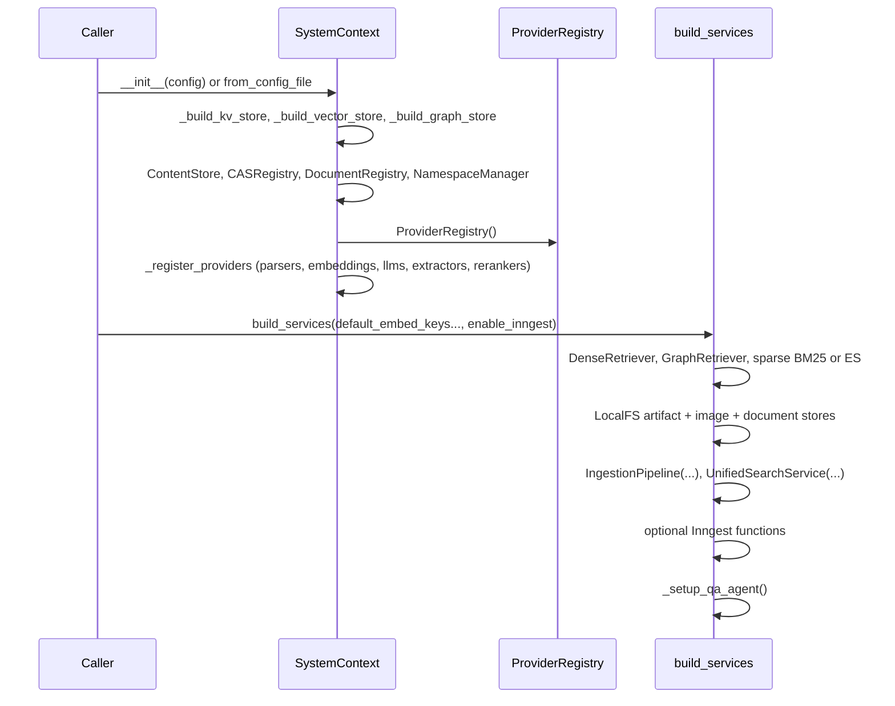
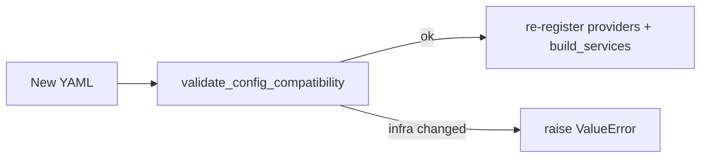

# System context and bootstrap

The **`SystemContext`** class (`unified_memory/bootstrap.py`) is the **composition root** for the library: it constructs infrastructure stores, CAS helpers, namespace management, the **ProviderRegistry**, and—after `build_services()`—the **IngestionPipeline** and **UnifiedSearchService**.

## Responsibilities

| Concern | Owned by |
| --- | --- |
| KV, vector, graph, optional Elasticsearch | `SystemContext` constructors (`_build_*`) |
| Content-addressable blob metadata | `CASRegistry`, `ContentStore` |
| Per-document and deduplication keys | `DocumentRegistry` |
| Multi-tenant namespace state | `NamespaceManager`, `TenantManager` |
| Embeddings, LLMs, extractors, rerankers, parsers | `ProviderRegistry` + `_register_providers` |
| High-level orchestration | `IngestionPipeline`, `UnifiedSearchService`, optional `QAAgent` |
| SQL-backed chat/audit (API only) | Set on context after `build_services` in FastAPI lifespan |

## Construction timeline

## Infrastructure matrix

The following table maps **config keys** (dict or YAML-derived) to **implementations**.

| Config key | Values | Python class |
| --- | --- | --- |
| `kv_store` | `memory`, `redis` | `MemoryKVStore`, `RedisKVStore` |
| `vector_store` | `memory`, `qdrant` | `MemoryVectorStore`, `QdrantVectorStore` |
| `graph_store` | `networkx`, `neo4j` | `NetworkXGraphStore`, `Neo4jGraphStore` |
| `sparse_retriever` | `bm25`, `elasticsearch` | In-process `SparseRetriever`, or `ElasticSearchStore` (shared for content + sparse) |

When `sparse_retriever == "elasticsearch"`, an **`ElasticSearchStore`** instance is created once and used as **`self.elasticsearch_store`** for both sparse retrieval and (where applicable) content indexing paths.

## `build_services` parameters

- **`default_text_embedding_key` / `default_vision_embedding_key`**: Resolved from `ProviderRegistry` and passed into `IngestionPipeline` for default embedders.
- **`enable_inngest`**: When `True`, constructs Inngest client, wires **ingest** and **delete** functions with `LocalFSArtifactStore`.
- **`artifact_store_dir`**: Base path for artifacts (default `/tmp/memory_artifacts`).

## Hot reload

`hot_reload_from_file(path)` reloads **provider registration** and **services** from a new YAML file while **keeping the same KV/vector/graph** instances. It **refuses** to change `kv_store`, `vector_store`, `graph_store`, or `sparse_retriever` if an `AppConfig` was previously loaded.

## API-specific fields

After HTTP startup (`api/app.py`), the following are attached to `SystemContext`:

- `sql_session_factory`: async SQLAlchemy sessions
- `chat_session_manager`: `ChatSessionManager`
- `audit_logger`: `AuditLogger`
- `tenant_manager`: refreshed `TenantManager` bound to the same KV store

`QAAgent` is constructed in `_setup_qa_agent` with optional `session_manager` once `chat_session_manager` exists (API path).

## Mental model

Think of **`SystemContext`** as a **dependency injection container** without a framework: explicit constructors, explicit `build_services`, and a single place (`bootstrap.py`) to read when tracing “where does this store come from?”.
