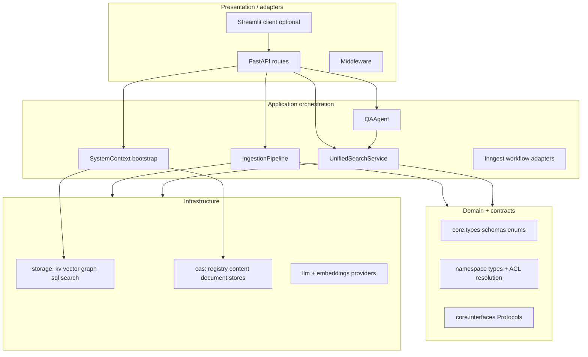

# System design — logical layers

This page describes **how responsibilities are split** in `unified_memory` so you can reason about dependencies, testing, and extension points. It complements the deployment-oriented view in [architecture-overview.md](./architecture-overview.md).

## Layer model

The codebase follows a **practical layered** structure (not a strict DDD package split, but the same ideas):

## Dependency direction (intended)

| Layer | May depend on |
| --- | --- |
| **Routes** | `SystemContext`, request schemas, **`ACLChecker`** / **`get_current_user`**, orchestration services |
| **Orchestration** (`pipeline`, `unified`, `agents`) | **Domain types**, **namespace manager**, **storage abstractions**, **ProviderRegistry** |
| **Domain** (`core/types`, `namespace/types`) | Standard library, typing; **not** FastAPI |
| **Infrastructure** (`storage/*`, provider impls) | **Protocols/ABCs** from `storage/base.py`, `embeddings/base.py`, etc. |

**Rule of thumb:** infrastructure implements interfaces; orchestration wires them; HTTP is a thin adapter.

## Horizontal cross-cutting concerns

| Concern | Where it lives |
| --- | --- |
| **Multi-tenancy** | `tenant_id` on users and configs; **`ACLChecker`** denies cross-tenant namespace access ([`api/deps.py`](../src/unified_memory/api/deps.py)) |
| **Tracing & usage** | `observability/tracing.py` + flush to **`TokenUsageRecord`** |
| **Configuration** | YAML → `AppConfig` → dict → **`SystemContext`** |

## Comparison: library vs HTTP server

| Mode | Entry | Persistence |
| --- | --- | --- |
| **Library** | `SystemContext` + `build_services()` | KV, vector, graph, CAS per config; **no** SQL unless you attach it |
| **HTTP API** | `uvicorn unified_memory.api.app:app` | Above **plus** SQLAlchemy (users, chat, audit, token usage) |

## Related documents

- [system-context-and-bootstrap.md](./system-context-and-bootstrap.md) — wiring details
- [inheritance-class-diagrams.md](./inheritance-class-diagrams.md) — ABCs and protocols
- [security-deployment-and-operations.md](./security-deployment-and-operations.md) — hardening the API layer
