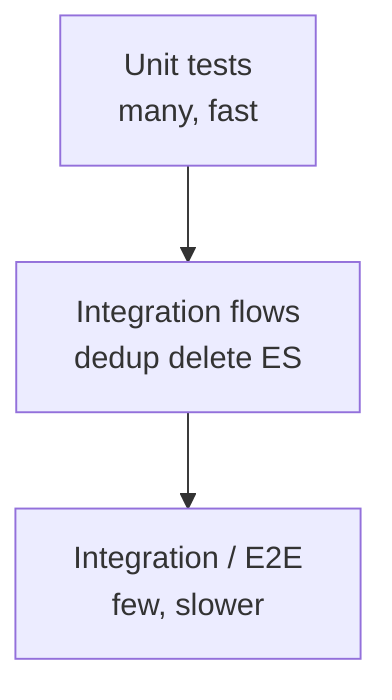

# Testing strategy

Tests live under **`tests/`** and use **pytest**. The layout separates **fast unit tests** from **integration tests** that require services (Docker) or heavier dependencies.

## Layout

```text
tests/
  conftest.py              # Shared fixtures
  integration/
    conftest.py
    test_end_to_end.py
    test_system_context_e2e.py
    test_elasticsearch_e2e.py
    test_dedup_flow.py
    test_delete_flow.py
    test_provenance_merging.py
    ...
  unit/
    core/
    cas/
    namespace/
    ingestion/
    retrieval/
    storage/
    embeddings/
    chunkers/
```

## Running tests

```bash
pip install -e ".[dev]"
pytest tests/unit -q
pytest tests/integration -q   # may require docker-compose / services
```

Use **`docker-compose.test.yml`** (see repository root) when integration tests expect Redis, Qdrant, Neo4j, Elasticsearch, etc.

## Continuous integration (GitHub Actions)

On **push** and **pull request** to `main` / `master`, **[`.github/workflows/ci.yml`](../.github/workflows/ci.yml)** runs:

| Job | What runs |
| --- | --- |
| **Unit tests** | `pytest tests/unit` on **Python 3.10** and **3.12** after `pip install -e ".[all]"` |
| **Integration tests** | Brings up **`docker-compose.test.yml`** (Redis, Qdrant, Neo4j, Elasticsearch), then `pytest tests/integration` with env vars pointing at `127.0.0.1` |

You can trigger the same workflow manually via **Actions → CI → Run workflow** (`workflow_dispatch`).

## What major suites cover

| Area | Example files | Focus |
| --- | --- | --- |
| Bootstrap / config | `unit/core/test_bootstrap.py`, `test_config_compatibility.py` | `SystemContext`, YAML validation |
| Types | `unit/core/test_types.py` | Core dataclasses and helpers |
| CAS | `unit/cas/test_*.py` | Registry, document registry, refcount deletes |
| Namespaces | `unit/namespace/test_*.py` | Validation, tenant manager |
| Ingestion | `unit/ingestion/test_pipeline.py`, `test_extractors.py`, `test_semantic_chunker.py` | Pipeline steps, chunkers, extractors |
| Retrieval | `unit/retrieval/test_unified.py`, `test_dense.py`, `test_fusion.py`, `test_rerankers.py` | Search, fusion, rerankers |
| Storage | `unit/storage/test_*.py` | KV, vector, graph backends |
| Integration | `integration/test_end_to_end.py`, `test_dedup_flow.py`, `test_delete_flow.py` | Full flows against real or test containers |

## Diagram: test pyramid



## Conventions

- Prefer **async tests** with **`pytest-asyncio`** where code under test is async (see `pyproject.toml` for asyncio mode).
- Use **mock embedding providers** where possible to avoid network calls.
- Keep **deterministic** seeds for any randomized chunking tests when applicable.
