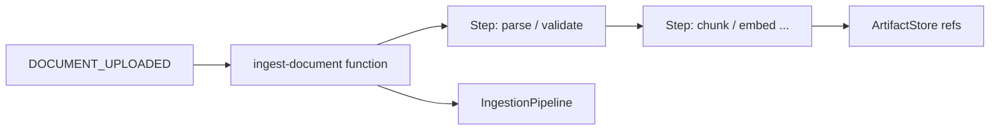

# Workflows (Inngest)

Optional **durable workflows** wrap **`IngestionPipeline`** operations with **retryable steps** and **artifact externalization** for large payloads.

## Enabling

1. Install **`workflows`** extra (`inngest` dependency in `pyproject.toml`).
2. Set **`UMS_ENABLE_INNGEST`** so **`api/app.py`** calls **`build_services(enable_inngest=True)`**.
3. Ensure **`inngest.fast_api`** can be imported for **`serve()`** registration.

## Modules

| File | Purpose |
| --- | --- |
| `workflows/client.py` | Inngest client singleton |
| `workflows/events.py` | Event name constants (e.g. `DOCUMENT_UPLOADED`) |
| `workflows/artifact_store.py` | **`LocalFSArtifactStore`** — filesystem artifact persistence |
| `workflows/ingest_function.py` | **`create_ingest_function`** — multi-step ingest with concurrency + cancel rules |
| `workflows/delete_function.py` | **`create_delete_function`** — durable delete |
| `workflows/job_state.py`, `serialization.py` | State and serialization helpers |

## Ingest function behavior (conceptual)

**`ingest_function.py`** builds an Inngest function with:

- **Trigger** on `DOCUMENT_UPLOADED`
- **Retries** and **per-tenant concurrency** limits
- **Cancellation** when a matching `DOCUMENT_DELETE_REQUESTED` event arrives

Large intermediate payloads are stored in the **`ArtifactStore`** so Inngest step outputs stay small.

## Bootstrap integration

`SystemContext._setup_inngest()` attaches:

- **`_inngest_client`**
- **`_inngest_functions`** — list passed to **`inngest.fast_api.serve`**

See [system-context-and-bootstrap.md](./system-context-and-bootstrap.md).
